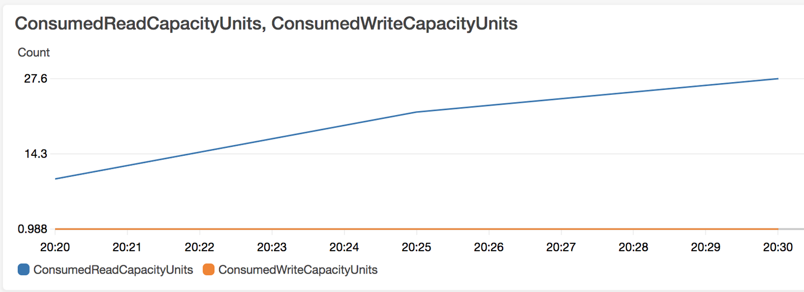
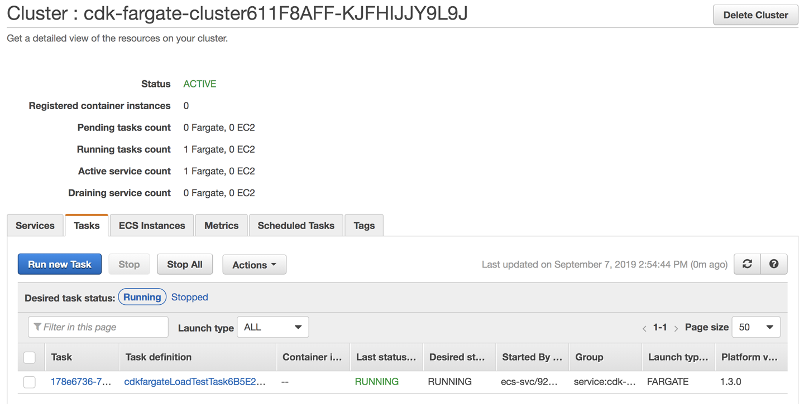
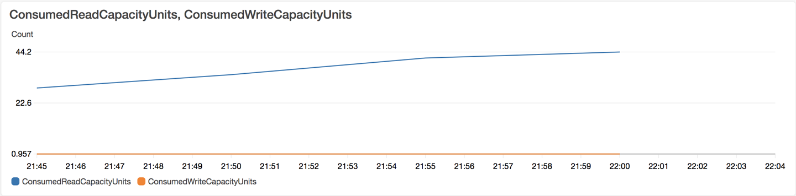

# Chapter 13. Serverless Technologies

Serverless is a term that generates a lot of buzz in the IT industry these days. As often happens with these kinds of terms, people have different opinions about what they actually mean. At face value, serverless implies a world where you do not need to worry about managing servers anymore. To some extent, this is true, but only for the developers who are using the functionality offered by serverless technologies. This chapter shows there is a lot of work that needs to happen behind the scenes for this magical world of no servers to come into being.

Many people equate the term serverless with Function as a Service (FaaS). This is partially true, and it mostly came about when AWS launched the Lambda service in 2015. AWS Lambdas are functions that can be run in the cloud without deploying a traditional server to host the functions. Hence the word serverless.

However, FaaS is not the only service that can be dubbed serverless. These days the Big Three public cloud providers (Amazon, Microsoft, and Google) all offer Containers as a Service (CaaS), which allows you to deploy full-blown Docker containers to their clouds without provisioning servers to host those containers. These services can also be called serverless. Examples of such services are AWS Fargate, Microsoft Azure Container Instances, and Google Cloud Run.

What are some use cases for serverless technologies? For FaaS technologies such as AWS Lambda, especially due to the event-driven manner in which Lambda functions can be triggered by other cloud services, use cases include:

* Extract-Transform-Load (ETL) data processing, where, as an example, a file is uploaded to S3, which triggers the execution of a Lambda function that does ETL processing on the data and sends it to a queue or a backend database

* ETL processing on logs sent by other services to CloudWatch

* Scheduling tasks in a cron-like manner based on CloudWatch Events triggering Lambda functions

* Real-time notifications based on Amazon SNS triggering Lambda functions

* Email processing using Lambda and Amazon SES

* Serverless website hosting, with the static web resources such as Javascript, CSS, and HTML stored in S3 and fronted by the CloudFront CDN service, and a REST API handled by an API Gateway routing the API requests to Lambda functions, which communicate with a backend such as Amazon RDS or Amazon DynamoDB

Many serverless use cases are identified in each of the cloud service providers’ online documentation. For example, in the Google Cloud serverless ecosystem, web applications are handled best by Google AppEngine, APIs are handled best by Google Functions, and CloudRun is preferred for running processes in Docker containers. For a concrete example, consider a service that needs to perform machine learning tasks such as object detection with the TensorFlow framework. Due to the compute, memory, and disk resource limitations of FaaS, combined with the limited availability of libraries in a FaaS setup, it is probably better to run such a service using a CaaS service such as Google Cloud Run, as opposed to a FaaS service such as Google Cloud Functions.

The Big Three cloud providers also offer a rich DevOps toolchain around their FaaS platforms. For example, when you use AWS Lambda, with little effort, you can also add these services from AWS:

* AWS X-Ray for tracing/observability

* Amazon CloudWatch for logging, alerting, and event scheduling

* AWS Step Functions for serverless workflow coordination

* AWS Cloud9 for an in-browser development environment

How do you choose between FaaS and CaaS? In one dimension, it depends on the unit of deployment. If you only care about short-lived functions, with few dependencies and small amounts of data processing, then FaaS can work for you. If, on the other hand, you have long-running processes with lots of dependencies and heavy computing power requirements, then you may be better off using CaaS. Most FaaS services have severe limits for running time (15 minutes maximum for Lambda), computing power, memory size, disk space, and HTTP request and response limits. The upside to FaaS’ short execution times is that you only pay for the duration of the function.

If you remember the discussion at the beginning of Chapter 12 on pets versus cattle versus insects, functions can truly be considered ephemeral insects that briefly come into existence, perform some processing, and disappear. Because of their ephemeral nature, functions in FaaS are also stateless, which is an important fact to keep in mind as you architect your application.

Another dimension for choosing between FaaS and CaaS is the number and type of interactions that your service has with other services. For example, an AWS Lambda function can be triggered asynchronously by no less than eight other AWS services, including S3, Simple Notification Service (SNS), Simple Email Service (SES), and CloudWatch. This richness of interactions makes it easier to write functions that respond to events, so FaaS wins in this case.

As you’ll see in this chapter, many FaaS services are actually based on Kubernetes, which these days is the de facto container orchestration standard. Even though your unit of deployment is a function, behind the scenes the FaaS tooling creates and pushes Docker containers to a Kubernetes cluster that you might or might not manage. OpenFaas and OpenWhisk are examples of such Kubernetes-based FaaS technologies. When you self-host these FaaS platforms, you very quickly become aware that server makes up most of the word serverless. All of a sudden you have to worry a lot about the care and feeding of your Kubernetes clusters.

When we split the word DevOps into its parts, Dev and Ops, serverless technologies are targeted more toward the Dev side. They help developers feel less friction when it comes to deploying their code. The burden, especially in a self-hosted scenario, is on Ops to provision the infrastructure (sometimes very complex) that will support the FaaS or CaaS platforms. However, even if the Dev side might feel there is little need for Ops when it comes to serverless (which happens, although by definition this split makes it a non-DevOps situation), there are still plenty of Ops-related issues to worry about when it comes to using a Serverless platform: security, scalability, resource limitations and capacity planning, monitoring, logging, and observability. These have traditionally been considered the domain of Ops, but in the brave new DevOps world we are talking about, they need to be tackled by both Dev and Ops in tandem and with cooperation. A Dev team should not feel that its task is done when it finishes writing the code. Instead, it should take ownership and yes, pride, in getting the service all the way to production, with good monitoring, logging, and tracing built in.

We start this chapter with examples of how to deploy the same Python function, representing a simple HTTP endpoint, to the Big Three cloud providers using their FaaS offerings.

> **NOTE**  
> Some of the commands used in the following examples produce large amounts of output. Except for cases where it is critical to the understanding of the command, we will omit the majority of the output lines to save trees and enable the reader to focus better on the text.

## Deploying the Same Python Function to the “Big Three” Cloud Providers  
For AWS and Google, we use the Serverless platform, which simplifies these deployments by abstracting the creation of cloud resources that are involved in the FaaS runtime environments. The Serverless platform does not yet support Python functions for Microsoft Azure, so in that case we show how to use Azure-specific CLI tooling.

### Installing Serverless Framework  
The Serverless platform is based on nodejs. To install it, use npm:
```
$ npm install -g serverless
```
### Deploying Python Function to AWS Lambda  
Start by cloning the Serverless platform examples GitHub repository:
```
$ git clone https://github.com/serverless/examples.git
$ cd aws-python-simple-http-endpoint
$ export AWS_PROFILE=gheorghiu-net
```
The Python HTTP endpoint is defined in the file handler.py:
```py
$ cat handler.py
import json
import datetime

def endpoint(event, context):
    current_time = datetime.datetime.now().time()
    body = {
        "message": "Hello, the current time is " + str(current_time)
    }

    response = {
        "statusCode": 200,
        "body": json.dumps(body)
    }

    return response
```
The Serverless platform uses a declarative approach for specifying the resources it needs to create with a YAML file called serverless.yaml. Here is file that declares a function called currentTime, corresponding to the Python function endpoint from the handler module defined previously:
```yml
$ cat serverless.yml
service: aws-python-simple-http-endpoint

frameworkVersion: ">=1.2.0 <2.0.0"

provider:
  name: aws
  runtime: python2.7 # or python3.7, supported as of November 2018

functions:
  currentTime:
    handler: handler.endpoint
    events:
      - http:
          path: ping
          method: get
```
Modify the Python version to 3.7 in serverless.yaml:
```
provider:
  name: aws
  runtime: python3.7
```
Deploy the function to AWS Lambda by running the serverless deploy command:
```
$ serverless deploy
Serverless: Packaging service...
Serverless: Excluding development dependencies...
Serverless: Uploading CloudFormation file to S3...
Serverless: Uploading artifacts...
Serverless:
Uploading service aws-python-simple-http-endpoint.zip file to S3 (1.95 KB)...
Serverless: Validating template...
Serverless: Updating Stack...
Serverless: Checking Stack update progress...
..............
Serverless: Stack update finished...
Service Information
service: aws-python-simple-http-endpoint
stage: dev
region: us-east-1
stack: aws-python-simple-http-endpoint-dev
resources: 10
api keys:
  None
endpoints:
  GET - https://3a88jzlxm0.execute-api.us-east-1.amazonaws.com/dev/ping
functions:
  currentTime: aws-python-simple-http-endpoint-dev-currentTime
layers:
  None
Serverless:
Run the "serverless" command to setup monitoring, troubleshooting and testing.
```
Test the deployed AWS Lambda function by hitting its endpoint with curl:
```
$ curl https://3a88jzlxm0.execute-api.us-east-1.amazonaws.com/dev/ping
{"message": "Hello, the current time is 23:16:30.479690"}%
```
Invoke the Lambda function directly with the serverless invoke command:
```json
$ serverless invoke --function currentTime
{
    "statusCode": 200,
    "body": "{\"message\": \"Hello, the current time is 23:18:38.101006\"}"
}
```
Invoke the Lambda function directly and inspect the log (which is sent to AWS CloudWatch Logs) at the same time:
```
$ serverless invoke --function currentTime --log
{
    "statusCode": 200,
    "body": "{\"message\": \"Hello, the current time is 23:17:11.182463\"}"
}
--------------------------------------------------------------------
START RequestId: 5ac3c9c8-f8ca-4029-84fa-fcf5157b1404 Version: $LATEST
END RequestId: 5ac3c9c8-f8ca-4029-84fa-fcf5157b1404
REPORT RequestId: 5ac3c9c8-f8ca-4029-84fa-fcf5157b1404
Duration: 1.68 ms Billed Duration: 100 ms   Memory Size: 1024 MB
Max Memory Used: 56 MB
```
Note how the Billed Duration in the preceding output is 100 ms. This shows one of the advantages of using FaaS—being billed in very short increments of time.

One other thing we want to draw your attention to is the heavy lifting behind the scenes by the Serverless platform in the creation of AWS resources that are part of the Lambda setup. Serverless creates a CloudFormation stack called, in this case, aws-python-simple-http-endpoint-dev. You can inspect it with the aws CLI tool:
```
$ aws cloudformation describe-stack-resources \
  --stack-name aws-python-simple-http-endpoint-dev
  --region us-east-1 | jq '.StackResources[].ResourceType'
"AWS::ApiGateway::Deployment"
"AWS::ApiGateway::Method"
"AWS::ApiGateway::Resource"
"AWS::ApiGateway::RestApi"
"AWS::Lambda::Function"
"AWS::Lambda::Permission"
"AWS::Lambda::Version"
"AWS::Logs::LogGroup"
"AWS::IAM::Role"
"AWS::S3::Bucket"
```
Note how this CloudFormation stack contains no less than 10 AWS resource types that you would have had to otherwise create or associate with one another manually.

###  Deploying Python Function to Google Cloud Functions
In this section, we will take as an example the code from the google-python-simple-http-endpoint directory from the Serverless platform examples GitHub repository:
```
$ gcloud projects list
PROJECT_ID                  NAME                        PROJECT_NUMBER
pulumi-gke-testing          Pulumi GKE Testing          705973980178
pythonfordevops-gke-pulumi  pythonfordevops-gke-pulumi  787934032650
```
Create a new GCP project:
```
$ gcloud projects create pythonfordevops-cloudfunction
```
Initialize the local gcloud environment:
```
$ gcloud init
Welcome! This command will take you through the configuration of gcloud.

Settings from your current configuration [pythonfordevops-gke-pulumi] are:
compute:
  region: us-west1
  zone: us-west1-c
core:
  account: grig.gheorghiu@gmail.com
  disable_usage_reporting: 'True'
  project: pythonfordevops-gke-pulumi

Pick configuration to use:
[1] Re-initialize this configuration with new settings
[2] Create a new configuration
[3] Switch to and re-initialize existing configuration: [default]
Please enter your numeric choice:  2

Enter configuration name. Names start with a lower case letter and
contain only lower case letters a-z, digits 0-9, and hyphens '-':
pythonfordevops-cloudfunction
Your current configuration has been set to: [pythonfordevops-cloudfunction]

Choose the account you would like to use to perform operations for
this configuration:
 [1] grig.gheorghiu@gmail.com
 [2] Log in with a new account
Please enter your numeric choice:  1

You are logged in as: [grig.gheorghiu@gmail.com].

Pick cloud project to use:
 [1] pulumi-gke-testing
 [2] pythonfordevops-cloudfunction
 [3] pythonfordevops-gke-pulumi
 [4] Create a new project
Please enter numeric choice or text value (must exactly match list
item):  2

Your current project has been set to: [pythonfordevops-cloudfunction].
```
Authorize local shell with GCP:
```
$ gcloud auth login
```
Use the Serverless framework to deploy the same Python HTTP endpoint as in the AWS Lambda example, but this time as a Google Cloud Function:
```
$ serverless deploy

  Serverless Error ---------------------------------------

  Serverless plugin "serverless-google-cloudfunctions"
  initialization errored: Cannot find module 'serverless-google-cloudfunctions'
Require stack:
- /usr/local/lib/node_modules/serverless/lib/classes/PluginManager.js
- /usr/local/lib/node_modules/serverless/lib/Serverless.js
- /usr/local/lib/node_modules/serverless/lib/utils/autocomplete.js
- /usr/local/lib/node_modules/serverless/bin/serverless.js

  Get Support --------------------------------------------
     Docs:          docs.serverless.com
     Bugs:          github.com/serverless/serverless/issues
     Issues:        forum.serverless.com

  Your Environment Information ---------------------------
     Operating System:          darwin
     Node Version:              12.9.0
     Framework Version:         1.50.0
     Plugin Version:            1.3.8
     SDK Version:               2.1.0
```
The error we just encountered is due to the fact that the dependencies specified in package.json have not been installed yet:
```json
$ cat package.json
{
  "name": "google-python-simple-http-endpoint",
  "version": "0.0.1",
  "description":
  "Example demonstrates how to setup a simple HTTP GET endpoint with python",
  "author": "Sebastian Borza <sebito91@gmail.com>",
  "license": "MIT",
  "main": "handler.py",
  "scripts": {
    "test": "echo \"Error: no test specified\" && exit 1"
  },
  "dependencies": {
    "serverless-google-cloudfunctions": "^2.1.0"
  }
}
```
The Serverless platform is written in node.js, so its packages need to be installed with npm install:
```
$ npm install
```
Try deploying again:
```
$ serverless deploy

  Error --------------------------------------------------

  Error: ENOENT: no such file or directory,
  open '/Users/ggheo/.gcloud/keyfile.json'
```
To generate a credentials key, create a new service account named sa on the GCP IAM service account page. In this case, the email for the new service account was set to sa-255@pythonfordevops-cloudfunction.iam.gserviceaccount.com.

Create a credentials key and download it as ~/.gcloud/pythonfordevops-cloudfunction.json.

Specify the project and the path to the key in serverless.yml:
```yml
$ cat serverless.yml

service: python-simple-http-endpoint

frameworkVersion: ">=1.2.0 <2.0.0"

package:
  exclude:
    - node_modules/**
    - .gitignore
    - .git/**

plugins:
  - serverless-google-cloudfunctions

provider:
  name: google
  runtime: python37
  project: pythonfordevops-cloudfunction
  credentials: ~/.gcloud/pythonfordevops-cloudfunction.json

functions:
  currentTime:
    handler: endpoint
    events:
      - http: path
```
Go to the GCP Deployment Manager page and enable the Cloud Deployment Manager API; then also enable billing for Google Cloud Storage.

Try deploying again:
```
$ serverless deploy
Serverless: Packaging service...
Serverless: Excluding development dependencies...
Serverless: Compiling function "currentTime"...
Serverless: Uploading artifacts...

  Error --------------------------------------------------

  Error: Not Found
  at createError
  (/Users/ggheo/code/mycode/examples/google-python-simple-http-endpoint/
  node_modules/axios/lib/core/createError.js:16:15)
  at settle (/Users/ggheo/code/mycode/examples/
  google-python-simple-http-endpoint/node_modules/axios/lib/
  core/settle.js:18:12)
  at IncomingMessage.handleStreamEnd
  (/Users/ggheo/code/mycode/examples/google-python-simple-http-endpoint/
  node_modules/axios/lib/adapters/http.js:202:11)
  at IncomingMessage.emit (events.js:214:15)
  at IncomingMessage.EventEmitter.emit (domain.js:476:20)
  at endReadableNT (_stream_readable.js:1178:12)
  at processTicksAndRejections (internal/process/task_queues.js:77:11)

  For debugging logs, run again after setting the "SLS_DEBUG=*"
  environment variable.
```
Read through the Serverless platform documentation on GCP credentials and roles.

The following roles need to be assigned to the service account used for the deployment:

* Deployment Manager Editor

* Storage Admin

* Logging Admin

* Cloud Functions Developer roles

Also read through the Serverless platform documentation on the GCP APIs that need to be enabled.

The following APIs need to be enabled in the GCP console:

* Google Cloud Functions

* Google Cloud Deployment Manager

* Google Cloud Storage

* Stackdriver Logging

Go to Deployment Manager in the GCP console and the inspect error messages:
```
sls-python-simple-http-endpoint-dev failed to deploy

sls-python-simple-http-endpoint-dev has resource warnings
sls-python-simple-http-endpoint-dev-1566510445295:
{"ResourceType":"storage.v1.bucket",
"ResourceErrorCode":"403",
"ResourceErrorMessage":{"code":403,
"errors":[{"domain":"global","location":"Authorization",
"locationType":"header",
"message":"The project to be billed is associated
with an absent billing account.",
"reason":"accountDisabled"}],
"message":"The project to be billed is associated
 with an absent billing account.",
 "statusMessage":"Forbidden",
 "requestPath":"https://www.googleapis.com/storage/v1/b",
 "httpMethod":"POST"}}
```
Delete the sls-python-simple-http-endpoint-dev deployment in the GCP console and run serverless deploy again:
```
$ serverless deploy

Deployed functions
first
  https://us-central1-pythonfordevops-cloudfunction.cloudfunctions.net/http
```
The serverless deploy command kept failing because initially we did not enable billing for Google Cloud Storage. The deployment was marked as failed for the service specified in serverless.yml, and subsequent serverless deploy commands failed even after enabling Cloud Storage billing. Once the failed deployment was deleted in the GCP console, the serverless deploy command started to work.

Invoke the deployed Google Cloud Function directly:
```
$ serverless invoke --function currentTime
Serverless: v1os7ptg9o48 {
    "statusCode": 200,
    "body": {
        "message": "Received a POST request at 03:46:39.027230"
    }
}
```
Use the serverless logs command to inspect the logs:
```
$ serverless logs --function currentTime
Serverless: Displaying the 4 most recent log(s):

2019-08-23T03:35:12.419846316Z: Function execution took 20 ms,
finished with status code: 200
2019-08-23T03:35:12.400499207Z: Function execution started
2019-08-23T03:34:27.133107221Z: Function execution took 11 ms,
finished with status code: 200
2019-08-23T03:34:27.122244864Z: Function execution started
```
Test the function endpoint with curl:
```
$ curl \
https://undefined-pythonfordevops-cloudfunction.cloudfunctions.net/endpoint
<!DOCTYPE html>
<html lang=en>
  <p><b>404.</b> <ins>That’s an error.</ins>
  <p>The requested URL was not found on this server.
  <ins>That’s all we know.</ins>
```
Since we didn’t define a region in serverless.yml, the endpoint URL starts with undefined and returns an error.

Set the region to us-central1 in serverless.yml:
```yml
provider:
  name: google
  runtime: python37
  region: us-central1
  project: pythonfordevops-cloudfunction
  credentials: /Users/ggheo/.gcloud/pythonfordevops-cloudfunction.json
```
Deploy the new version with serverless deploy and test the function endpoint with curl:
```
$ curl \
https://us-central1-pythonfordevops-cloudfunction.cloudfunctions.net/endpoint
{
    "statusCode": 200,
    "body": {
        "message": "Received a GET request at 03:51:02.560756"
    }
}%
```
### Deploying Python Function to Azure  
The Serverless platform does not yet support Azure Functions based on Python. We will demonstrate how to deploy Azure Python Functions using Azure-native tools.

Sign up for a Microsoft Azure account and install the Azure Functions runtime for your specific operating system, following the official Microsoft documentation. If you are on a macOS, use brew:
```
$ brew tap azure/functions
$ brew install azure-functions-core-tools
```
Create a new directory for the Python function code:
```
$ mkdir azure-functions-python
$ cd azure-functions-python
```
Install Python 3.6 because 3.7 is not supported by Azure Functions. Create and activate virtualenv:
```
$ brew unlink python
$ brew install \
https://raw.githubusercontent.com/Homebrew/homebrew-core/
f2a764ef944b1080be64bd88dca9a1d80130c558/Formula/python.rb \
--ignore-dependencies

$ python3 -V
Python 3.6.5

$ python3 -m venv .venv
$ source .venv/bin/activate
```
Using the Azure func utility, create a local Functions project called python-simple-http-endpoint:
```
$ func init python-simple-http-endpoint
Select a worker runtime:
1. dotnet
2. node
3. python
4. powershell (preview)
Choose option: 3
```
Change directories to the newly created python-simple-http-endpoint directory and create an Azure HTTP Trigger Function with the func new command:
```
$ cd python-simple-http-endpoint
$ func new
Select a template:
1. Azure Blob Storage trigger
2. Azure Cosmos DB trigger
3. Azure Event Grid trigger
4. Azure Event Hub trigger
5. HTTP trigger
6. Azure Queue Storage trigger
7. Azure Service Bus Queue trigger
8. Azure Service Bus Topic trigger
9. Timer trigger
Choose option: 5
HTTP trigger
Function name: [HttpTrigger] currentTime
Writing python-simple-http-endpoint/currentTime/__init__.py
Writing python-simple-http-endpoint/currentTime/function.json
The function "currentTime" was created successfully
from the "HTTP trigger" template.
```
Inspect the Python code created:
```py
$ cat currentTime/__init__.py
import logging

import azure.functions as func

def main(req: func.HttpRequest) -> func.HttpResponse:
    logging.info('Python HTTP trigger function processed a request.')

    name = req.params.get('name')
    if not name:
        try:
            req_body = req.get_json()
        except ValueError:
            pass
        else:
            name = req_body.get('name')

    if name:
        return func.HttpResponse(f"Hello {name}!")
    else:
        return func.HttpResponse(
             "Please pass a name on the query string or in the request body",
             status_code=400
        )
```
Run the function locally:
```
$ func host start

[8/24/19 12:21:35 AM] Host initialized (299ms)
[8/24/19 12:21:35 AM] Host started (329ms)
[8/24/19 12:21:35 AM] Job host started
[8/24/19 12:21:35 AM]  INFO: Starting Azure Functions Python Worker.
[8/24/19 12:21:35 AM]  INFO: Worker ID: e49c429d-9486-4167-9165-9ecd1757a2b5,
Request ID: 2842271e-a8fe-4643-ab1a-f52381098ae6, Host Address: 127.0.0.1:53952
Hosting environment: Production
Content root path: python-simple-http-endpoint
Now listening on: http://0.0.0.0:7071
Application started. Press Ctrl+C to shut down.
[8/24/19 12:21:35 AM] INFO: Successfully opened gRPC channel to 127.0.0.1:53952

Http Functions:

  currentTime: [GET,POST] http://localhost:7071/api/currentTime
```
Test from another terminal:
```
$ curl http://127.0.0.1:7071/api/currentTime\?name\=joe
Hello joe!%
```
Change HTTP handler in currentTime/init.py to include the current time in its response:
```py
import datetime

def main(req: func.HttpRequest) -> func.HttpResponse:
    logging.info('Python HTTP trigger function processed a request.')

    name = req.params.get('name')
    if not name:
        try:
            req_body = req.get_json()
        except ValueError:
            pass
        else:
            name = req_body.get('name')

    current_time = datetime.datetime.now().time()
    if name:
        return func.HttpResponse(f"Hello {name},
        the current time is {current_time}!")
    else:
        return func.HttpResponse(
             "Please pass a name on the query string or in the request body",
             status_code=400
        )
```
Test the new function with curl:
```
$ curl http://127.0.0.1:7071/api/currentTime\?name\=joe
Hello joe, the current time is 17:26:54.256060!%
```
Install the Azure CLI with pip:
```
$ pip install azure.cli
```
Create an Azure Resource Group, Storage Account, and Function App using the az CLI utility in interactive mode. This mode places you in an interactive shell with auto-completion, command descriptions, and examples. Note that if you want to follow along, you will need to specify a different and unique functionapp name. You might also need to specify a different Azure region, such as eastus, that supports free trial accounts:
```
$ az interactive
az>> login
az>> az group create --name myResourceGroup --location westus2
az>> az storage account create --name griggheorghiustorage --location westus2 \
--resource-group myResourceGroup --sku Standard_LRS
az>> az functionapp create --resource-group myResourceGroup --os-type Linux \
--consumption-plan-location westus2 --runtime python \
--name pyazure-devops4all \
--storage-account griggheorghiustorage
az>> exit
```
Deploy the functionapp project to Azure using the func utility:
```
$ func azure functionapp publish pyazure-devops4all --build remote
Getting site publishing info...
Creating archive for current directory...
Perform remote build for functions project (--build remote).
Uploading 2.12 KB

OUTPUT OMITTED

Running post deployment command(s)...
Deployment successful.
App container will begin restart within 10 seconds.
Remote build succeeded!
Syncing triggers...
Functions in pyazure-devops4all:
    currentTime - [httpTrigger]
      Invoke url:
      https://pyazure-devops4all.azurewebsites.net/api/
      currenttime?code=b0rN93O04cGPcGFKyX7n9HgITTPnHZiGCmjJN/SRsPX7taM7axJbbw==
```
Test the deployed function in Azure by hitting its endpoint with curl:
```
$ curl "https://pyazure-devops4all.azurewebsites.net/api/currenttime\
?code\=b0rN93O04cGPcGFKyX7n9HgITTPnHZiGCmjJN/SRsPX7taM7axJbbw\=\=\&name\=joe"
Hello joe, the current time is 01:20:32.036097!%
```
It is always a good idea to remove any cloud resources you don’t need anymore. In this case, you can run:
```
$ az group delete --name myResourceGroup
```
## Deploying a Python Function to Self-Hosted FaaS Platforms  
As mentioned earlier in this chapter, many FaaS platforms are running on top of Kubernetes clusters. One advantage of this approach is that the functions you deploy run as regular Docker containers inside Kubernetes, so you can use your existing Kubernetes tooling, especially when it comes to observability (monitoring, logging, and tracing). Another advantage is potential cost savings. By running your serverless functions as containers inside an existing Kubernetes cluster, you can use the existing capacity of the cluster and not pay per function call as you would if you deployed your functions to a third-party FaaS platform.

In this section, we consider one of these platforms: OpenFaaS. Some other examples of similar FaaS platforms running on Kubernetes include the following:

* Kubeless

* Fn Project (the underlying technology powering the Oracle FaaS offering called Oracle Functions)

* Fission

* Apache OpenWhisk

###  Deploying Python Function to OpenFaaS  
For this example, we use a “Kubernetes-lite” distribution from Rancher called k3s. We use k3s instead of minikube to showcase the wide variety of tools available in the Kubernetes ecosystem.

Start by running the k3sup utility to provision a k3s Kubernetes cluster on an Ubuntu EC2 instance.

Download and install k3sup:
```
$ curl -sLS https://get.k3sup.dev | sh
$ sudo cp k3sup-darwin /usr/local/bin/k3sup
```
Verify SSH connectivity into the remote EC2 instance:
```
$ ssh ubuntu@35.167.68.86 date
Sat Aug 24 21:38:57 UTC 2019
```
Install k3s via k3sup install:
```
$ k3sup install --ip 35.167.68.86 --user ubuntu
OUTPUT OMITTED
Saving file to: kubeconfig
```
Inspect the kubeconfig file:
```yml
$ cat kubeconfig
apiVersion: v1
clusters:
- cluster:
    certificate-authority-data: BASE64_FIELD
    server: https://35.167.68.86:6443
  name: default
contexts:
- context:
    cluster: default
    user: default
  name: default
current-context: default
kind: Config
preferences: {}
users:
- name: default
  user:
    password: OBFUSCATED
    username: admin
```
Point the KUBECONFIG environment variable to the local kubeconfig file and test kubectl commands against the remote k3s cluster:
```
$ export KUBECONFIG=./kubeconfig

$ kubectl cluster-info
Kubernetes master is running at https://35.167.68.86:6443
CoreDNS is running at
https://35.167.68.86:6443/api/v1/namespaces/kube-system/
services/kube-dns:dns/proxy

To further debug and diagnose cluster problems, use
'kubectl cluster-info dump'.

$ kubectl get nodes
NAME            STATUS   ROLES    AGE   VERSION
ip-10-0-0-185   Ready    master   10m   v1.14.6-k3s.1
```
The next step is to install the OpenFaas Serverless platform on the k3s Kubernetes cluster.

Install faas-cli on the local macOS:
```
$ brew install faas-cli
```
Create RBAC permissions for Tiller, which is the server component of Helm:
```
$ kubectl -n kube-system create sa tiller \
  && kubectl create clusterrolebinding tiller \
  --clusterrole cluster-admin \
  --serviceaccount=kube-system:tiller
serviceaccount/tiller created
clusterrolebinding.rbac.authorization.k8s.io/tiller created
```
Install Tiller via helm init:
```
$ helm init --skip-refresh --upgrade --service-account tiller
```
Download, configure, and install the Helm chart for OpenFaaS:
```yml
$ wget \
https://raw.githubusercontent.com/openfaas/faas-netes/master/namespaces.yml

$ cat namespaces.yml
apiVersion: v1
kind: Namespace
metadata:
  name: openfaas
  labels:
    role: openfaas-system
    access: openfaas-system
    istio-injection: enabled
---
apiVersion: v1
kind: Namespace
metadata:
  name: openfaas-fn
  labels:
    istio-injection: enabled
    role: openfaas-fn

$ kubectl apply -f namespaces.yml
namespace/openfaas created
namespace/openfaas-fn created

$ helm repo add openfaas https://openfaas.github.io/faas-netes/
"openfaas" has been added to your repositories
```
Generate a random password for basic authentication to the OpenFaaS gateway:
```
$ PASSWORD=$(head -c 12 /dev/urandom | shasum| cut -d' ' -f1)

$ kubectl -n openfaas create secret generic basic-auth \
--from-literal=basic-auth-user=admin \
--from-literal=basic-auth-password="$PASSWORD"
secret/basic-auth created
```
Deploy OpenFaaS by installing the Helm chart:
```
$ helm repo update \
 && helm upgrade openfaas --install openfaas/openfaas \
    --namespace openfaas  \
    --set basic_auth=true \
    --set serviceType=LoadBalancer \
    --set functionNamespace=openfaas-fn

OUTPUT OMITTED

NOTES:
To verify that openfaas has started, run:
kubectl --namespace=openfaas get deployments -l "release=openfaas,app=openfaas"
```
> **NOTE**  
> The basic_auth setup used here without TLS should ONLY be used for experimenting/learning. Any environment of consquence should be configured to ensure that credentials are passed over a secure TLS connection.

Verify the services running in the openfaas namespace:
```
$ kubectl get service -nopenfaas
NAME                TYPE           CLUSTER-IP      EXTERNAL-IP   PORT(S)
alertmanager        ClusterIP      10.43.193.61    <none>        9093/TCP
basic-auth-plugin   ClusterIP      10.43.83.12     <none>        8080/TCP
gateway             ClusterIP      10.43.7.46      <none>        8080/TCP
gateway-external    LoadBalancer   10.43.91.91     10.0.0.185    8080:31408/TCP
nats                ClusterIP      10.43.33.153    <none>        4222/TCP
prometheus          ClusterIP      10.43.122.184   <none>        9090/TCP
```
Forward port 8080 from the remote instance to port 8080 locally:
```
$ kubectl port-forward -n openfaas svc/gateway 8080:8080 &
[1] 29183
Forwarding from 127.0.0.1:8080 -> 8080
```
Go to the OpenFaaS web UI at http://localhost:8080 and log in using username admin and password $PASSWORD.

Continue by creating an OpenFaaS Python function. Use the faas-cli tool to create a new OpenFaaS function called hello-python:
```
$ faas-cli new --lang python hello-python
Folder: hello-python created.
Function created in folder: hello-python
Stack file written: hello-python.yml
```
Inspect the configuration file for the hello-python function:
```yml
$ cat hello-python.yml
version: 1.0
provider:
  name: openfaas
  gateway: http://127.0.0.1:8080
functions:
  hello-python:
    lang: python
    handler: ./hello-python
    image: hello-python:latest
```
Inspect the automatically created directory hello-python:
```
$ ls -la hello-python
total 8
drwx------  4 ggheo  staff  128 Aug 24 15:16 .
drwxr-xr-x  8 ggheo  staff  256 Aug 24 15:16 ..
-rw-r--r--  1 ggheo  staff  123 Aug 24 15:16 handler.py
-rw-r--r--  1 ggheo  staff    0 Aug 24 15:16 requirements.txt
```
```py
$ cat hello-python/handler.py
def handle(req):
    """handle a request to the function
    Args:
        req (str): request body
    """

    return req
```
Edit handler.py and bring over the code that prints the current time from the Serverless platform’s simple-http-example:
```py
$ cat hello-python/handler.py
import json
import datetime

def handle(req):
    """handle a request to the function
    Args:
        req (str): request body
    """

    current_time = datetime.datetime.now().time()
    body = {
        "message": "Received a {} at {}".format(req, str(current_time))
    }

    response = {
        "statusCode": 200,
        "body": body
    }
    return json.dumps(response, indent=4)
```
The next step is to build the OpenFaaS Python function. Use the faas-cli build command, which will build a Docker image based on an autogenerated Dockerfile:
```
$ faas-cli build -f ./hello-python.yml
[0] > Building hello-python.
Clearing temporary build folder: ./build/hello-python/
Preparing ./hello-python/ ./build/hello-python//function
Building: hello-python:latest with python template. Please wait..
Sending build context to Docker daemon  8.192kB
Step 1/29 : FROM openfaas/classic-watchdog:0.15.4 as watchdog

DOCKER BUILD OUTPUT OMITTED

Successfully tagged hello-python:latest
Image: hello-python:latest built.
[0] < Building hello-python done.
[0] worker done.
````
Check that the Docker image is present locally:
```
$ docker images | grep hello-python
hello-python                          latest
05b2c37407e1        29 seconds ago      75.5MB
```
Tag and push the Docker image to Docker Hub registry so it can be used on the remote Kubernetes cluster:
```
$ docker tag hello-python:latest griggheo/hello-python:latest
```
Edit hello-python.yml and change:
```
image: griggheo/hello-python:latest
```
Use the faas-cli push command to push the image to Docker Hub:
```
$ faas-cli push -f ./hello-python.yml
[0] > Pushing hello-python [griggheo/hello-python:latest].
The push refers to repository [docker.io/griggheo/hello-python]
latest: digest:
sha256:27e1fbb7f68bb920a6ff8d3baf1fa3599ae92e0b3c607daac3f8e276aa7f3ae3
size: 4074
[0] < Pushing hello-python [griggheo/hello-python:latest] done.
[0] worker done.
```
Next, deploy the OpenFaaS Python function to the remote k3s cluster. Use the faas-cli deploy command to deploy the function:
```
$ faas-cli deploy -f ./hello-python.yml
Deploying: hello-python.
WARNING! Communication is not secure, please consider using HTTPS.
Letsencrypt.org offers free SSL/TLS certificates.
Handling connection for 8080

unauthorized access, run "faas-cli login"
to setup authentication for this server

Function 'hello-python' failed to deploy with status code: 401
```
Use the faas-cli login command to obtain authenication credentials:
```
$ echo -n $PASSWORD | faas-cli login -g http://localhost:8080 \
-u admin --password-stdin
Calling the OpenFaaS server to validate the credentials...
Handling connection for 8080
WARNING! Communication is not secure, please consider using HTTPS.
Letsencrypt.org offers free SSL/TLS certificates.
credentials saved for admin http://localhost:8080
```
Edit hello-python.yml and change:
```
gateway: http://localhost:8080
```
Because we are returning JSON from our handler, add these lines to hello-python.yml:  
```yml
    environment:
      content_type: application/json
```
Contents of hello-python.yml:
```yml
$ cat hello-python.yml
version: 1.0
provider:
  name: openfaas
  gateway: http://localhost:8080
functions:
  hello-python:
    lang: python
    handler: ./hello-python
    image: griggheo/hello-python:latest
    environment:
      content_type: application/json
```
Run the faas-cli deploy command again:
```
$ faas-cli deploy -f ./hello-python.yml
Deploying: hello-python.
WARNING! Communication is not secure, please consider using HTTPS.
Letsencrypt.org offers free SSL/TLS certificates.
Handling connection for 8080
Handling connection for 8080

Deployed. 202 Accepted.
URL: http://localhost:8080/function/hello-python
```
If a code change is needed, use the following commands to rebuild and redeploy the function. Note that the faas-cli remove command will delete the current version of the function:
```
$ faas-cli build -f ./hello-python.yml
$ faas-cli push -f ./hello-python.yml
$ faas-cli remove -f ./hello-python.yml
$ faas-cli deploy -f ./hello-python.yml
```
Now test the deployed function with curl:
```
$ curl localhost:8080/function/hello-python --data-binary 'hello'
Handling connection for 8080
{
    "body": {
        "message": "Received a hello at 22:55:05.225295"
    },
    "statusCode": 200
}
```
Test by invoking the function directly with faas-cli:
```
$ echo -n "hello" | faas-cli invoke hello-python
Handling connection for 8080
{
    "body": {
        "message": "Received a hello at 22:56:23.549509"
    },
    "statusCode": 200
}
```
The next example will be more full featured. We will demonstrate how to use the AWS CDK to provision several Lambda functions behind an API Gateway for create/read/update/delete (CRUD) REST access to todo items stored in a DynamoDB table. We will also show how to load test our REST API with containers deployed in AWS Fargate and running the Locust load-testing tool against the API. The Fargate containers will also be provisioned with the AWS CDK.

## Provisioning DynamoDB Table, Lambda Functions, and API Gateway Methods Using the AWS CDK  
We briefly mentioned the AWS CDK in Chapter 10. AWS CDK is a product that allows you to define the desired state of the infrastructure using real code (currently supported languages are TypeScript and Python), as opposed to using a YAML definition file (as the Serverless platform does).

Install CDK CLI with npm at the global level (depending on your operating system, you may need to run the following command with sudo):
```
$ npm install cdk -g
```
Create a directory for the CDK application:
```
$ mkdir cdk-lambda-dynamodb-fargate
$ cd cdk-lambda-dynamodb-fargate
```
Create a sample Python application with cdk init:
```
$ cdk init app --language=python
Applying project template app for python
Executing Creating virtualenv...

# Welcome to your CDK Python project!

This is a blank project for Python development with CDK.
The `cdk.json` file tells the CDK Toolkit how to execute your app.
```
List the files created:
```
$ ls -la
total 40
drwxr-xr-x   9 ggheo  staff   288 Sep  2 10:10 .
drwxr-xr-x  12 ggheo  staff   384 Sep  2 10:10 ..
drwxr-xr-x   6 ggheo  staff   192 Sep  2 10:10 .env
-rw-r--r--   1 ggheo  staff  1651 Sep  2 10:10 README.md
-rw-r--r--   1 ggheo  staff   252 Sep  2 10:10 app.py
-rw-r--r--   1 ggheo  staff    32 Sep  2 10:10 cdk.json
drwxr-xr-x   4 ggheo  staff   128 Sep  2 10:10 cdk_lambda_dynamodb_fargate
-rw-r--r--   1 ggheo  staff     5 Sep  2 10:10 requirements.txt
-rw-r--r--   1 ggheo  staff  1080 Sep  2 10:10 setup.py
```
Inspect the main file app.py:
```py
$ cat app.py
#!/usr/bin/env python3

from aws_cdk import core

from cdk_lambda_dynamodb_fargate.cdk_lambda_dynamodb_fargate_stack \
import CdkLambdaDynamodbFargateStack

app = core.App()
CdkLambdaDynamodbFargateStack(app, "cdk-lambda-dynamodb-fargate")

app.synth()
```
A CDK program is composed of an app that can contain one or more stacks. A stack corresponds to a CloudFormation stack object.

Inspect the module defining the CDK stack:
```py
$ cat cdk_lambda_dynamodb_fargate/cdk_lambda_dynamodb_fargate_stack.py
from aws_cdk import core

class CdkLambdaDynamodbFargateStack(core.Stack):

    def __init__(self, scope: core.Construct, id: str, **kwargs) -> None:
        super().__init__(scope, id, **kwargs)

        # The code that defines your stack goes here
```
Because we are going to have two stacks, one for the DynamoDB/Lambda/API Gateway resources, and one for the Fargate resources, rename

*cdk_lambda_dynamodb_fargate/cdk_lambda_dynamodb_fargate_stack.py*

to cdk_lambda_dynamodb_fargate/cdk_lambda_dynamodb_stack.py

and the *class CdkLambdaDynamodbFargateStack to CdkLambdaDynamodbStack.*

Also change app.py to refer to the changed module and class names:
```py
from cdk_lambda_dynamodb_fargate.cdk_lambda_dynamodb_stack \
import CdkLambdaDynamodbStack

CdkLambdaDynamodbStack(app, "cdk-lambda-dynamodb")
```
Activate virtualenv:
```
$ source .env/bin/activate
```
We are going to take the URL shortener CDK example and modify it with code from the Serverless platform AWS Python REST API example to build a REST API for creating, listing, getting, updating, and deleting todo items. Amazon DynamoDB is used to store the data.

Inspect the serverless.yml file from examples/aws-python-rest-api-with-dynamodb and deploy it with the serverless command to see what AWS resources get created:
```
$ pwd
~/code/examples/aws-python-rest-api-with-dynamodb

$ serverless deploy
Serverless: Stack update finished...
Service Information
service: serverless-rest-api-with-dynamodb
stage: dev
region: us-east-1
stack: serverless-rest-api-with-dynamodb-dev
resources: 34
api keys:
  None
endpoints:
POST - https://tbst34m2b7.execute-api.us-east-1.amazonaws.com/dev/todos
GET - https://tbst34m2b7.execute-api.us-east-1.amazonaws.com/dev/todos
GET - https://tbst34m2b7.execute-api.us-east-1.amazonaws.com/dev/todos/{id}
PUT - https://tbst34m2b7.execute-api.us-east-1.amazonaws.com/dev/todos/{id}
DELETE - https://tbst34m2b7.execute-api.us-east-1.amazonaws.com/dev/todos/{id}
functions:
  create: serverless-rest-api-with-dynamodb-dev-create
  list: serverless-rest-api-with-dynamodb-dev-list
  get: serverless-rest-api-with-dynamodb-dev-get
  update: serverless-rest-api-with-dynamodb-dev-update
  delete: serverless-rest-api-with-dynamodb-dev-delete
layers:
  None
Serverless: Run the "serverless" command to setup monitoring, troubleshooting and
            testing.
```
The previous command created five Lambda functions, one API Gateway, and one DynamoDB table.

In the CDK directory, add a DynamoDB table to the stack we are building:
```py
$ pwd
~/code/devops/serverless/cdk-lambda-dynamodb-fargate

$ cat cdk_lambda_dynamodb_fargate/cdk_lambda_dynamodb_stack.py
from aws_cdk import core
from aws_cdk import aws_dynamodb

class CdkLambdaDynamodbStack(core.Stack):

    def __init__(self, scope: core.Construct, id: str, **kwargs) -> None:
        super().__init__(scope, id, **kwargs)

        # define the table stores Todo items
        table = aws_dynamodb.Table(self, "Table",
                                    partition_key=aws_dynamodb.Attribute(
                                      name="id",
                                      type=aws_dynamodb.AttributeType.STRING),
                                    read_capacity=10,
                                    write_capacity=5)
```
Install the required Python modules:
```
$ cat requirements.txt
-e .
aws-cdk.core
aws-cdk.aws-dynamodb

$ pip install -r requirements.txt
```
Inspect the CloudFormation stack that will be created by running cdk synth:
```
$ export AWS_PROFILE=gheorghiu-net
$ cdk synth
```
Pass a variable called variable containing the region value to the constructor CdkLambdaDynamodbStack in app.py:
```py
app_env = {"region": "us-east-2"}
CdkLambdaDynamodbStack(app, "cdk-lambda-dynamodb", env=app_env)
```
Run cdk synth again:
```yml
$ cdk synth
Resources:
  TableCD117FA1:
    Type: AWS::DynamoDB::Table
    Properties:
      KeySchema:
        - AttributeName: id
          KeyType: HASH
      AttributeDefinitions:
        - AttributeName: id
          AttributeType: S
      ProvisionedThroughput:
        ReadCapacityUnits: 10
        WriteCapacityUnits: 5
    UpdateReplacePolicy: Retain
    DeletionPolicy: Retain
    Metadata:
      aws:cdk:path: cdk-lambda-dynamodb-fargate/Table/Resource
  CDKMetadata:
    Type: AWS::CDK::Metadata
    Properties:
      Modules: aws-cdk=1.6.1,
      @aws-cdk/aws-applicationautoscaling=1.6.1,
      @aws-cdk/aws-autoscaling-common=1.6.1,
      @aws-cdk/aws-cloudwatch=1.6.1,
      @aws-cdk/aws-dynamodb=1.6.1,
      @aws-cdk/aws-iam=1.6.1,
      @aws-cdk/core=1.6.1,
      @aws-cdk/cx-api=1.6.1,@aws-cdk/region-info=1.6.1,
      jsii-runtime=Python/3.7.4
```
Deploy the CDK stack by running cdk deploy:
```
$ cdk deploy
cdk-lambda-dynamodb-fargate: deploying...
cdk-lambda-dynamodb-fargate: creating CloudFormation changeset...
 0/3 | 11:12:25 AM | CREATE_IN_PROGRESS   | AWS::DynamoDB::Table |
 Table (TableCD117FA1)
 0/3 | 11:12:25 AM | CREATE_IN_PROGRESS   | AWS::CDK::Metadata   |
 CDKMetadata
 0/3 | 11:12:25 AM | CREATE_IN_PROGRESS   | AWS::DynamoDB::Table |
 Table (TableCD117FA1) Resource creation Initiated
 0/3 | 11:12:27 AM | CREATE_IN_PROGRESS   | AWS::CDK::Metadata   |
 CDKMetadata Resource creation Initiated
 1/3 | 11:12:27 AM | CREATE_COMPLETE      | AWS::CDK::Metadata   |
 CDKMetadata
 2/3 | 11:12:56 AM | CREATE_COMPLETE      | AWS::DynamoDB::Table |
 Table (TableCD117FA1)
 3/3 | 11:12:57 AM | CREATE_COMPLETE      | AWS::CloudFormation::Stack |
 cdk-lambda-dynamodb-fargate

Stack ARN:
arn:aws:cloudformation:us-east-2:200562098309:stack/
cdk-lambda-dynamodb/3236a8b0-cdad-11e9-934b-0a7dfa8cb208
```
The next step is to add Lambda functions and the API Gateway resource to the stack.

In the CDK code directory, create a lambda directory and copy the Python modules from the Serverless platform AWS Python REST API example:
```
$ pwd
~/code/devops/serverless/cdk-lambda-dynamodb-fargate

$ mkdir lambda
$ cp ~/code/examples/aws-python-rest-api-with-dynamodb/todos/* lambda
$ ls -la lambda
total 48
drwxr-xr-x   9 ggheo  staff   288 Sep  2 10:41 .
drwxr-xr-x  10 ggheo  staff   320 Sep  2 10:19 ..
-rw-r--r--   1 ggheo  staff     0 Sep  2 10:41 __init__.py
-rw-r--r--   1 ggheo  staff   822 Sep  2 10:41 create.py
-rw-r--r--   1 ggheo  staff   288 Sep  2 10:41 decimalencoder.py
-rw-r--r--   1 ggheo  staff   386 Sep  2 10:41 delete.py
-rw-r--r--   1 ggheo  staff   535 Sep  2 10:41 get.py
-rw-r--r--   1 ggheo  staff   434 Sep  2 10:41 list.py
-rw-r--r--   1 ggheo  staff  1240 Sep  2 10:41 update.py
```
Add the required modules to requirements.txt and install them with pip:
```
$ cat requirements.txt
-e .
aws-cdk.core
aws-cdk.aws-dynamodb
aws-cdk.aws-lambda
aws-cdk.aws-apigateway

$ pip install -r requirements.txt
```
Create Lambda and API Gateway constructs in the stack module:
```py
$ cat cdk_lambda_dynamodb_fargate/cdk_lambda_dynamodb_stack.py
from aws_cdk import core
from aws_cdk.core import App, Construct, Duration
from aws_cdk import aws_dynamodb, aws_lambda, aws_apigateway

class CdkLambdaDynamodbStack(core.Stack):

    def __init__(self, scope: core.Construct, id: str, **kwargs) -> None:
        super().__init__(scope, id, **kwargs)

        # define the table stores Todo todos
        table = aws_dynamodb.Table(self, "Table",
            partition_key=aws_dynamodb.Attribute(
                name="id",
                type=aws_dynamodb.AttributeType.STRING),
            read_capacity=10,
            write_capacity=5)

        # define the Lambda functions
        list_handler = aws_lambda.Function(self, "TodoListFunction",
            code=aws_lambda.Code.asset("./lambda"),
            handler="list.list",
            timeout=Duration.minutes(5),
            runtime=aws_lambda.Runtime.PYTHON_3_7)

        create_handler = aws_lambda.Function(self, "TodoCreateFunction",
            code=aws_lambda.Code.asset("./lambda"),
            handler="create.create",
            timeout=Duration.minutes(5),
            runtime=aws_lambda.Runtime.PYTHON_3_7)

        get_handler = aws_lambda.Function(self, "TodoGetFunction",
            code=aws_lambda.Code.asset("./lambda"),
            handler="get.get",
            timeout=Duration.minutes(5),
            runtime=aws_lambda.Runtime.PYTHON_3_7)

        update_handler = aws_lambda.Function(self, "TodoUpdateFunction",
            code=aws_lambda.Code.asset("./lambda"),
            handler="update.update",
            timeout=Duration.minutes(5),
            runtime=aws_lambda.Runtime.PYTHON_3_7)

        delete_handler = aws_lambda.Function(self, "TodoDeleteFunction",
            code=aws_lambda.Code.asset("./lambda"),
            handler="delete.delete",
            timeout=Duration.minutes(5),
            runtime=aws_lambda.Runtime.PYTHON_3_7)

        # pass the table name to each handler through an environment variable
        # and grant the handler read/write permissions on the table.
        handler_list = [
            list_handler,
            create_handler,
            get_handler,
            update_handler,
            delete_handler
        ]
        for handler in handler_list:
            handler.add_environment('DYNAMODB_TABLE', table.table_name)
            table.grant_read_write_data(handler)

        # define the API endpoint
        api = aws_apigateway.LambdaRestApi(self, "TodoApi",
            handler=list_handler,
            proxy=False)

        # define LambdaIntegrations
        list_lambda_integration = \
            aws_apigateway.LambdaIntegration(list_handler)
        create_lambda_integration = \
            aws_apigateway.LambdaIntegration(create_handler)
        get_lambda_integration = \
            aws_apigateway.LambdaIntegration(get_handler)
        update_lambda_integration = \
            aws_apigateway.LambdaIntegration(update_handler)
        delete_lambda_integration = \
            aws_apigateway.LambdaIntegration(delete_handler)

        # define REST API model and associate methods with LambdaIntegrations
        api.root.add_method('ANY')

        todos = api.root.add_resource('todos')
        todos.add_method('GET', list_lambda_integration)
        todos.add_method('POST', create_lambda_integration)

        todo = todos.add_resource('{id}')
        todo.add_method('GET', get_lambda_integration)
        todo.add_method('PUT', update_lambda_integration)
        todo.add_method('DELETE', delete_lambda_integration)
```
It is worth noting several features of the code we just reviewed:

* We were able to use the add_environment method on each handler object to pass the environment variable DYNAMODB_TABLE used in the Python code for the Lambda functions and set it to table.table_name. The name of the DynamoDB table is not known at construction time, so the CDK will replace it with a token and will set the token to the correct name of the table when it deploys the stack (see the Tokens documentation for more details).

* We made full use of a simple programming language construct, the for loop, when we iterated over the list of all Lambda handlers. While this may seem natural, it is still worth pointing out because loops and variable passing are features that are awkwardly implemented, if at all, in YAML-based Infrastructure as Code tools such as Terraform.

* We defined the HTTP methods (GET, POST, PUT, DELETE) associated with various endpoints of the API Gateway and associated the correct Lambda function with each of them.

Deploy the stack with cdk deploy:
```
$ cdk deploy
cdk-lambda-dynamodb-fargate failed: Error:
This stack uses assets, so the toolkit stack must be deployed
to the environment
(Run "cdk bootstrap aws://unknown-account/us-east-2")
```
Fix by running cdk bootstrap:
```
$ cdk bootstrap
Bootstrapping environment aws://ACCOUNTID/us-east-2...
CDKToolkit: creating CloudFormation changeset...
Environment aws://ACCOUNTID/us-east-2 bootstrapped.
```
Deploy the CDK stack again:
```
$ cdk deploy
OUTPUT OMITTED

Outputs:
cdk-lambda-dynamodb.TodoApiEndpointC1E16B6C =
https://k6ygy4xw24.execute-api.us-east-2.amazonaws.com/prod/

Stack ARN:
arn:aws:cloudformation:us-east-2:ACCOUNTID:stack/cdk-lambda-dynamodb/
15a66bb0-cdba-11e9-aef9-0ab95d3a5528
```
The next step is to test the REST API with curl.

First create a new todo item:
```
$ curl -X \
POST https://k6ygy4xw24.execute-api.us-east-2.amazonaws.com/prod/todos \
--data '{ "text": "Learn CDK" }'
{"id": "19d55d5a-cdb4-11e9-9a8f-9ed29c44196e", "text": "Learn CDK",
"checked": false,
"createdAt": "1567450902.262834",
"updatedAt": "1567450902.262834"}%
```
Create a second todo item:
```
$ curl -X \
POST https://k6ygy4xw24.execute-api.us-east-2.amazonaws.com/prod/todos \
--data '{ "text": "Learn CDK with Python" }'
{"id": "58a992c6-cdb4-11e9-9a8f-9ed29c44196e", "text": "Learn CDK with Python",
"checked": false,
"createdAt": "1567451007.680936",
"updatedAt": "1567451007.680936"}%
```
Try getting the details for the item just created by specifying its ID:
```
$ curl \
https://k6ygy4xw24.execute-api.us-east-2.amazonaws.com/
prod/todos/58a992c6-cdb4-11e9-9a8f-9ed29c44196e
{"message": "Internal server error"}%
```
Investigate by inspecting the CloudWatch Logs for the Lambda function TodoGetFunction:
```
[ERROR] Runtime.ImportModuleError:
Unable to import module 'get': No module named 'todos'
```
To fix, change the line in lambda/get.py from:
```py
from todos import decimalencoder
```
to:
```py
import decimalencoder
```
Redeploy the stack with cdk deploy.

Try getting the todo item details with curl again:
```json
$ curl \
https://k6ygy4xw24.execute-api.us-east-2.amazonaws.com/
prod/todos/58a992c6-cdb4-11e9-9a8f-9ed29c44196e
{"checked": false, "createdAt": "1567451007.680936",
"text": "Learn CDK with Python",
"id": "58a992c6-cdb4-11e9-9a8f-9ed29c44196e",
"updatedAt": "1567451007.680936"}
```
Make the import decimalencoder change to all modules in the lambda directory that need the decimalencoder module and redeploy with cdk deploy.

List all todos and format the output with the jq utility:
```json
$ curl \
https://k6ygy4xw24.execute-api.us-east-2.amazonaws.com/prod/todos | jq
[
  {
    "checked": false,
    "createdAt": "1567450902.262834",
    "text": "Learn CDK",
    "id": "19d55d5a-cdb4-11e9-9a8f-9ed29c44196e",
    "updatedAt": "1567450902.262834"
  },
  {
    "checked": false,
    "createdAt": "1567451007.680936",
    "text": "Learn CDK with Python",
    "id": "58a992c6-cdb4-11e9-9a8f-9ed29c44196e",
    "updatedAt": "1567451007.680936"
  }
]
```
Delete a todo and verify that the list does not contain it anymore:
```json
$ curl -X DELETE \
https://k6ygy4xw24.execute-api.us-east-2.amazonaws.com/prod/todos/
19d55d5a-cdb4-11e9-9a8f-9ed29c44196e

$ curl https://k6ygy4xw24.execute-api.us-east-2.amazonaws.com/prod/todos | jq
[
  {
    "checked": false,
    "createdAt": "1567451007.680936",
    "text": "Learn CDK with Python",
    "id": "58a992c6-cdb4-11e9-9a8f-9ed29c44196e",
    "updatedAt": "1567451007.680936"
  }
]
```
Now test updating an existing todo item with curl:
```json
$ curl -X \
PUT https://k6ygy4xw24.execute-api.us-east-2.amazonaws.com/prod/todos/
58a992c6-cdb4-11e9-9a8f-9ed29c44196e \
--data '{ "text": "Learn CDK with Python by reading the PyForDevOps book" }'
{"message": "Internal server error"}%
```
Inspecting the CloudWatch logs for the Lambda function associated with this endpoint shows:
```
[ERROR] Exception: Couldn't update the todo item.
Traceback (most recent call last):
  File "/var/task/update.py", line 15, in update
    raise Exception("Couldn't update the todo item.")
```
Change the validation test in lambda/update.py to:
```py
    data = json.loads(event['body'])
    if 'text' not in data:
        logging.error("Validation Failed")
        raise Exception("Couldn't update the todo item.")
```
Also change the value for checked to True, since we have already seen a post that we are trying to update:
```py
ExpressionAttributeValues={
         ':text': data['text'],
         ':checked': True,
         ':updatedAt': timestamp,
       },
```
Redeploy the stack with cdk deploy_.

Test updating the todo item with curl:
```json
$ curl -X \
PUT https://k6ygy4xw24.execute-api.us-east-2.amazonaws.com/prod/todos/
58a992c6-cdb4-11e9-9a8f-9ed29c44196e \
--data '{ "text": "Learn CDK with Python by reading the PyForDevOps book"}'
{"checked": true, "createdAt": "1567451007.680936",
"text": "Learn CDK with Python by reading the PyForDevOps book",
"id": "58a992c6-cdb4-11e9-9a8f-9ed29c44196e", "updatedAt": 1567453288764}%
```
List the todo items to verify the update:
```json
$ curl https://k6ygy4xw24.execute-api.us-east-2.amazonaws.com/prod/todos | jq
[
  {
    "checked": true,
    "createdAt": "1567451007.680936",
    "text": "Learn CDK with Python by reading the PyForDevOps book",
    "id": "58a992c6-cdb4-11e9-9a8f-9ed29c44196e",
    "updatedAt": 1567453288764
  }
]
```
The next step is to provision AWS Fargate containers that will run a load test against the REST API we just deployed. Each container will run a Docker image that uses the Taurus test automation framework to run the Molotov load-testing tool. We introduced Molotov in Chapter 5 as a simple and very useful Python-based load-testing tool.

Start by creating a Dockerfile for running Taurus and Molotov in a directory called loadtest:
```dockerfile
$ mkdir loadtest; cd loadtest
$ cat Dockerfile
FROM blazemeter/taurus

COPY scripts /scripts
COPY taurus.yaml /bzt-configs/

WORKDIR /bzt-configs
ENTRYPOINT ["sh", "-c", "bzt -l /tmp/artifacts/bzt.log /bzt-configs/taurus.yaml"]
```
The Dockerfile runs the Taurus bzt command line using the taurus.yaml configuration file:
```yml
$ cat taurus.yaml
execution:
- executor: molotov
  concurrency: 10  # number of Molotov workers
  iterations: 5  # iteration limit for the test
  ramp-up: 30s
  hold-for: 5m
  scenario:
    script: /scripts/loadtest.py  # has to be valid Molotov script
```
In this configuration file, the value for concurrency is set to 10, which means that we are simulating 10 concurrent users or virtual users (VUs). The executor is defined as a molotov test based on a script called loadtest.py in the scripts directory. Here is the script, which is a Python module:
```py
$ cat scripts/loadtest.py
import os
import json
import random
import molotov
from molotov import global_setup, scenario

@global_setup()
def init_test(args):
    BASE_URL=os.getenv('BASE_URL', '')
    molotov.set_var('base_url', BASE_URL)

@scenario(weight=50)
async def _test_list_todos(session):
    base_url= molotov.get_var('base_url')
    async with session.get(base_url + '/todos') as resp:
        assert resp.status == 200, resp.status

@scenario(weight=30)
async def _test_create_todo(session):
    base_url= molotov.get_var('base_url')
    todo_data = json.dumps({'text':
      'Created new todo during Taurus/molotov load test'})
    async with session.post(base_url + '/todos',
      data=todo_data) as resp:
        assert resp.status == 200

@scenario(weight=10)
async def _test_update_todo(session):
    base_url= molotov.get_var('base_url')
    # list all todos
    async with session.get(base_url + '/todos') as resp:
        res = await resp.json()
        assert resp.status == 200, resp.status
        # choose random todo and update it with PUT request
        todo_id = random.choice(res)['id']
        todo_data = json.dumps({'text':
          'Updated existing todo during Taurus/molotov load test'})
        async with session.put(base_url + '/todos/' + todo_id,
          data=todo_data) as resp:
            assert resp.status == 200

@scenario(weight=10)
async def _test_delete_todo(session):
    base_url= molotov.get_var('base_url')
    # list all todos
    async with session.get(base_url + '/todos') as resp:
        res = await resp.json()
        assert resp.status == 200, resp.status
        # choose random todo and delete it with DELETE request
        todo_id = random.choice(res)['id']
        async with session.delete(base_url + '/todos/' + todo_id) as resp:
            assert resp.status == 200
```
The script has four functions decorated as scenarios to be run by Molotov. They exercise various endpoints of the CRUD REST API. The weights indicate the approximate percentage of the time of the overall test duration that each scenario will be invoked. For example, the _test_list_todos function will be invoked in this example approximately 50% of the time, _test_create_todo will run approximately 30% of the time, and _test_update_todo and _test_delete_todo will each run approximately 10% of the time.

Build the local Docker image:
```
$ docker build -t cdk-loadtest .
```
Create the local artifacts directory:
```
$ mkdir artifacts
```
Run the local Docker image and mount the local artifacts directory as /tmp/artifacts inside the Docker container:
```
$ docker run --rm -d \
--env BASE_URL=https://k6ygy4xw24.execute-api.us-east-2.amazonaws.com/prod \
-v `pwd`/artifacts:/tmp/artifacts cdk-loadtest
```
Debug the Molotov script by inspecting the artifacts/molotov.out file.

Taurus results can be inspected either with docker logs CONTAINER_ID or by inspecting the file artifacts/bzt.log.

Results obtained by inspecting the Docker logs:
```
$ docker logs -f a228f8f9a2bc
19:26:26 INFO: Taurus CLI Tool v1.13.8
19:26:26 INFO: Starting with configs: ['/bzt-configs/taurus.yaml']
19:26:26 INFO: Configuring...
19:26:26 INFO: Artifacts dir: /tmp/artifacts
19:26:26 INFO: Preparing...
19:26:27 INFO: Starting...
19:26:27 INFO: Waiting for results...
19:26:32 INFO: Changed data analysis delay to 3s
19:26:32 INFO: Current: 0 vu  1 succ  0 fail  0.546 avg rt  /
Cumulative: 0.546 avg rt, 0% failures
19:26:39 INFO: Current: 1 vu  1 succ  0 fail  1.357 avg rt  /
Cumulative: 0.904 avg rt, 0% failures
ETC
19:41:00 WARNING: Please wait for graceful shutdown...
19:41:00 INFO: Shutting down...
19:41:00 INFO: Post-processing...
19:41:03 INFO: Test duration: 0:14:33
19:41:03 INFO: Samples count: 1857, 0.00% failures
19:41:03 INFO: Average times: total 6.465, latency 0.000, connect 0.000
19:41:03 INFO: Percentiles:
+---------------+---------------+
| Percentile, % | Resp. Time, s |
+---------------+---------------+
|           0.0 |          0.13 |
|          50.0 |          1.66 |
|          90.0 |        14.384 |
|          95.0 |         26.88 |
|          99.0 |        27.168 |
|          99.9 |        27.584 |
|         100.0 |        27.792 |
+---------------+---------------+
```
Create CloudWatch dashboards for the Lambda duration (Figure 13-1) and DynamoDB provisioned and consumed read and write capacity units (Figure 13-2).

  
*Figure 13-1. Lambda duration*  

  
*Figure 13-2. DynamoDB provisioned and consumed read and write capacity units*  

The DynamoDB metrics show that we underprovisioned the DynamoDB read capacity units. This introduced latency, especially for the List function (shown in the Lambda duration graph as the red line going to 14.7 seconds), which retrieves all todo items from the DynamoDB table, and thus is heavy on read operations. We set the value of the provisioned read capacity units to 10 when we created the DynamoDB table, and the CloudWatch graph shows it going to 25.

Let’s change the DynamoDB table type from PROVISIONED to PAY_PER_REQUEST. Make the change in cdk_lambda_dynamodb_fargate/cdk_lambda_dynamodb_stack.py:
```py
        table = aws_dynamodb.Table(self, "Table",
            partition_key=aws_dynamodb.Attribute(
                name="id",
                type=aws_dynamodb.AttributeType.STRING),
            billing_mode = aws_dynamodb.BillingMode.PAY_PER_REQUEST)
```
Run cdk deploy and then run the local Docker load-testing container.

This time the results are much better:
```
+---------------+---------------+
| Percentile, % | Resp. Time, s |
+---------------+---------------+
|           0.0 |         0.136 |
|          50.0 |         0.505 |
|          90.0 |         1.296 |
|          95.0 |         1.444 |
|          99.0 |         1.806 |
|          99.9 |         2.226 |
|         100.0 |          2.86 |
+---------------+---------------+
```
The graphs for Lambda duration (Figure 13-3) and DynamoDB consumed read and write capacity units (Figure 13-4) look much better as well.

  
*Figure 13-3. Lambda duration*  

  
*Figure 13-4. DynamoDB consumed read and write capacity units*  

Note that the DynamoDB consumed read capacity units are automatically allocated on demand by DynamoDB, and are scaling up to sustain the increased number of read requests from the Lambda functions. The function that contributes the most to the read requests is the List function that is called in the list, update, and delete scenarios in the Molotov loadtest.py script via session.get(base_url + /todos).

Next, we will create a Fargate CDK stack that will run containers based on the Docker image created previously:
```py
$ cat cdk_lambda_dynamodb_fargate/cdk_fargate_stack.py
from aws_cdk import core
from aws_cdk import aws_ecs, aws_ec2

class FargateStack(core.Stack):
    def __init__(self, scope: core.Construct, id: str, **kwargs) -> None:
        super().__init__(scope, id, **kwargs)

        vpc = aws_ec2.Vpc(
            self, "MyVpc",
            cidr= "10.0.0.0/16",
            max_azs=3
        )
        # define an ECS cluster hosted within the requested VPC
        cluster = aws_ecs.Cluster(self, 'cluster', vpc=vpc)

        # define our task definition with a single container
        # the image is built & published from a local asset directory
        task_definition = aws_ecs.FargateTaskDefinition(self, 'LoadTestTask')
        task_definition.add_container('TaurusLoadTest',
            image=aws_ecs.ContainerImage.from_asset("loadtest"),
            environment={'BASE_URL':
            "https://k6ygy4xw24.execute-api.us-east-2.amazonaws.com/prod/"})

        # define our fargate service. TPS determines how many instances we
        # want from our task (each task produces a single TPS)
        aws_ecs.FargateService(self, 'service',
            cluster=cluster,
            task_definition=task_definition,
            desired_count=1)
```
A few things to note in the code for the FargateStack class:

* A new VPC is created by using the aws_ec2.Vpc CDK construct.

* An ECS cluster is created in the new VPC.

* A Fargate task definition is created based on the Dockerfile from the loadtest directory; the CDK is smart enough to build a Docker image based on this Dockerfile and then push it to the ECR Docker registry.

* An ECS service is created to run Fargate containers based on the image pushed to ECR; the desired_count parameter specifies how many containers we want to run.

Call the FargateStack constructor in app.py:
```py
$ cat app.py
#!/usr/bin/env python3

from aws_cdk import core

from cdk_lambda_dynamodb_fargate.cdk_lambda_dynamodb_stack \
import CdkLambdaDynamodbStack
from cdk_lambda_dynamodb_fargate.cdk_fargate_stack import FargateStack

app = core.App()
app_env = {
    "region": "us-east-2",
}

CdkLambdaDynamodbStack(app, "cdk-lambda-dynamodb", env=app_env)
FargateStack(app, "cdk-fargate", env=app_env)

app.synth()
```
Deploy the cdk-fargate stack:
```
$ cdk deploy cdk-fargate
```
Go to the AWS console and inspect the ECS cluster with the running Fargate container (Figure 13-5).

  
*Figure 13-5. ECS cluster with running Fargate container*  

Inspect the CloudWatch dashboards for Lambda duration (Figure 13-6) and DynamoDB consumed read and write capacity units (Figure 13-7), noting that latency looks good.

  
*Figure 13-6. Lambda duration*  

  
*Figure 13-7. DynamoDB consumed read and write capacity units*  
Increase the Fargate container count to 5 in cdk_lambda_dynamodb_fargate/cdk_fargate_stack.py:
```py
       aws_ecs.FargateService(self, 'service',
           cluster=cluster,
           task_definition=task_definition,
           desired_count=5)
```
Redeploy the cdk-fargate stack:
```
$ cdk deploy cdk-fargate
```
Inspect the CloudWatch dashboards for Lambda duration (Figure 13-8) and DynamoDB consumed read and write capacity units (Figure 13-9).

  
*Figure 13-8. Lambda duration*  
  
*Figure 13-9. DynamoDB consumed read and write capacity units*  

Both DynamoDB read capacity units and Lambda duration metrics increased as expected because we are now simulating 5 × 10 = 50 concurrent users.

To simulate more users, we can both increase the concurrency value in the taurus.yaml configuration file, and increase the desired_count for the Fargate containers. Between these two values, we can easily increase the load on our REST API endpoints.

Delete the CDK stacks:
```
$ cdk destroy cdk-fargate
$ cdk destroy cdk-lambda-dynamodb
```
It is worth noting that the serverless architecture we deployed (API Gateway + five Lambda functions + DynamoDB table) turned out to be a good fit for our CRUD REST API application. We also followed best practices and defined all our infrastructure in Python code by using the AWS CDK.

# Exercises  
* Run a simple HTTP endpoint using Google’s CaaS platform: Cloud Run.  
* Run a simple HTTP endpoint on the other FaaS platforms we mentioned that are based on Kubernetes: Kubeless, Fn Project, and Fission.  
* Install and configure Apache OpenWhisk inside a production-grade Kubernetes cluster such as Amazon EKS, Google GKE, or Azure AKS.  
* Port the AWS REST API example to GCP and Azure. GCP offers Cloud Endpoints to manage multiple APIs. Similarly, Azure offers API Management.  