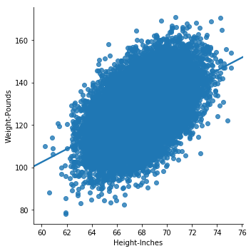
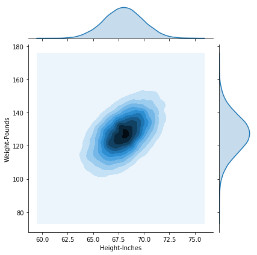
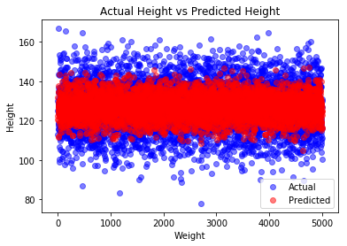
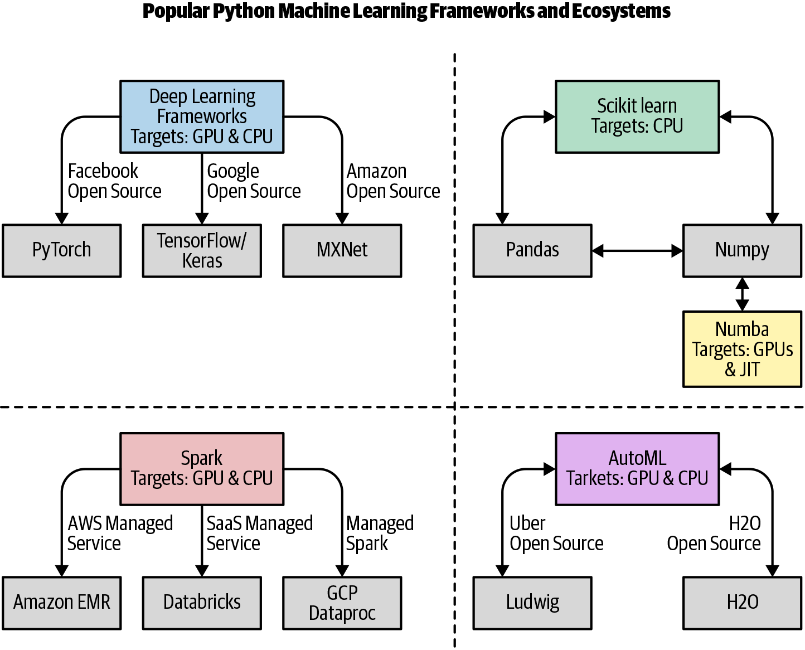
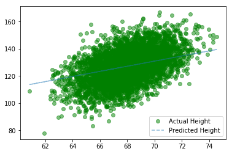
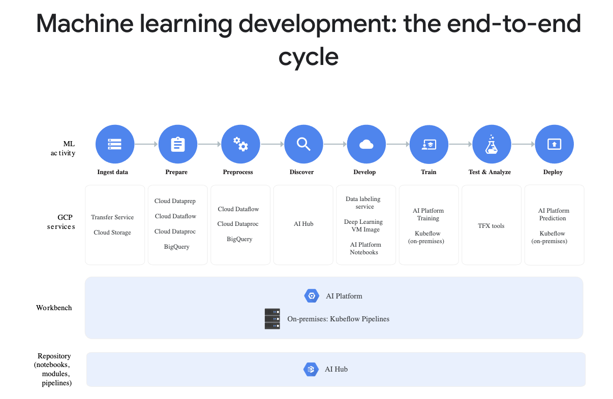
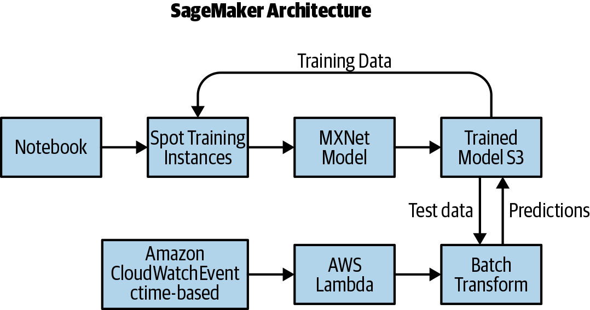
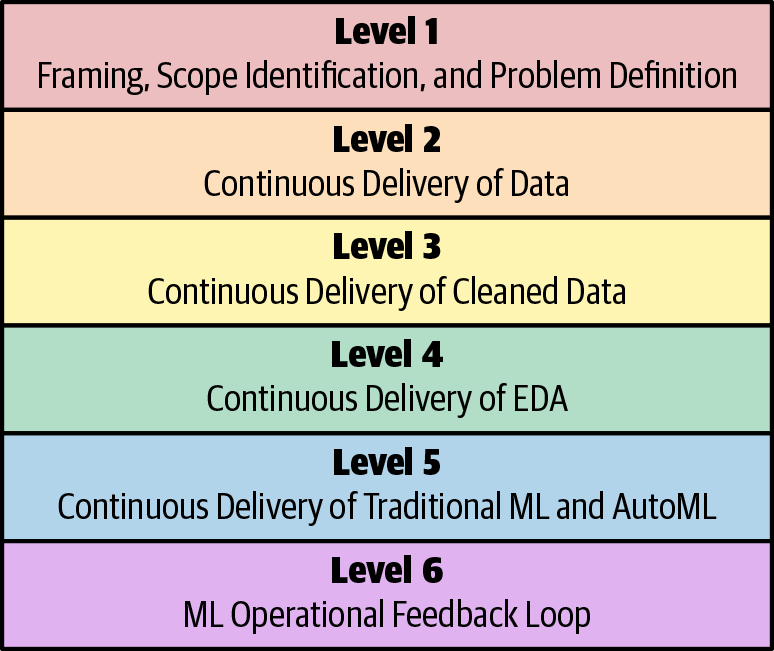
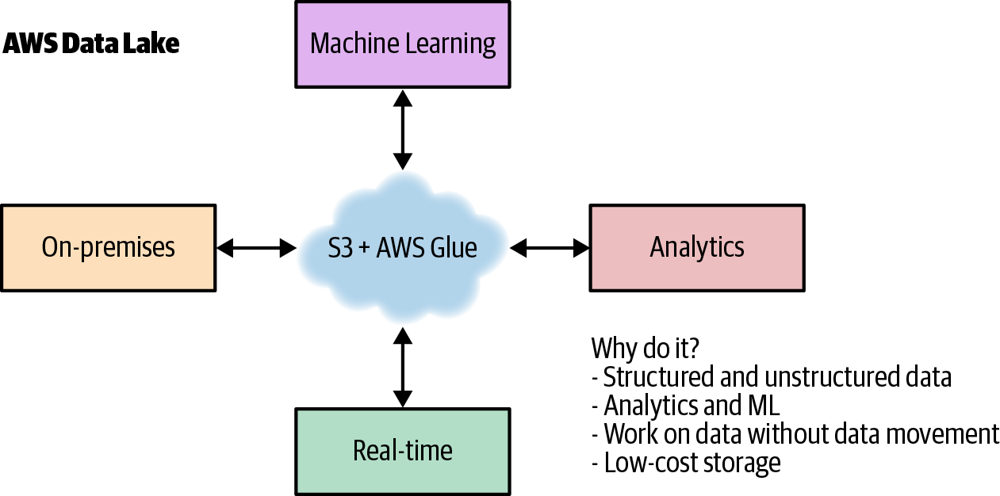

# Chapter 14. MLOps and Machine learning Engineering

One of the hottest job titles in 2020 is machine learning engineer. Other hot job titles include data engineer, data scientist, and machine learning scientist. While you can be a DevOps specialist, DevOps is a behavior, and the principles of DevOps can be applied to any software project, including machine learning. Let’s look at the some core DevOps best practices: Continuous Integration, Continuous Delivery, Microservices, Infrastructure as Code, Monitoring and Logging, and Communication and Collaboration. Which of these doesn’t apply to machine learning?

The more complex a software engineering project is, and machine learning is complex, the more you need DevOps principles. Is there a better example of a Microservice than an API that does machine learning prediction? In this chapter, let’s dive into the nitty-gritty of doing machine learning in a professional and repeatable way using a DevOps mindset.

## What Is Machine Learning?  
Machine learning is a method of using algorithms to automatically learn from data. There are four main types: supervised, semi-supervised, unsupervised, and reinforcement.

### Supervised Machine Learning  
In supervised machine learning, the correct answers are already known and labeled. For example, if you wanted to predict height from weight, you could collect examples of people’s heights and weights. The height would be the target and the weight would be the feature.

Let’s walk through what an example of supervised machine learning looks like:

* Original dataset  

* 25,000 synthetic records of heights and weights of 18-year-old children  

```py
INGEST
In[0]:

import pandas as pd
In[7]:

df = pd.read_csv(
  "https://raw.githubusercontent.com/noahgift/\
  regression-concepts/master/\
  height-weight-25k.csv")
df.head()
Out[7]:
```

| | Index	| Height-Inches	| Weight-Pounds |
|-|-------|---------------|---------------|
| 0 | 1 | 65.78331 | 112.9925 |
| 1 | 2 | 71.51521 | 136.4873 |
| 2 | 3 | 69.39874 | 153.0269 |
| 3 | 4 | 68.21660 | 142.3354 |
| 4 | 5 | 67.78781 | 144.2971 |

### EDA  
Let’s look at the data and see what can be explored.

* Scatterplot  
In this example, seaborn, a popular plotting library in Python, is used to visualize the dataset. If you need to install it, you can always install with !pip install seaborn in your notebook. You can also install any other library in the section with the !pip install \<name of package\>. If you are using a Colab notebook, these libraries are installed for you. See the graph for the height/weight lm plot (Figure 14-1).
```py
In[0]:

import seaborn as sns
import numpy as np
In[9]:

sns.lmplot("Height-Inches", "Weight-Pounds", data=df)
```
   
*Figure 14-1. Height/weight lm plot*  

### DESCRIPTIVE STATISTICS  
Next, some descriptive statistics can be generated.
```py
In[10]:

df.describe()
Out[10]:
```
|  | Index	| Height-Inches	| Weight-Pounds |
|--|--------|---------------|---------------|
| count | 25000.000000 | 25000.000000 | 25000.000000 |
| mean | 12500.500000 | 67.993114 | 127.079421 |
| std | 7217.022701 | 1.901679 | 11.660898 |
| min | 1.000000 | 60.278360 | 78.014760 |
| 25% | 6250.750000 | 66.704397 | 119.308675 |
| 50% | 12500.500000 | 67.995700 | 127.157750 |
| 75% | 18750.250000 | 69.272958 | 134.892850 |
| max | 25000.000000 | 75.152800 | 170.924000 |

### KERNEL DENSITY DISTRIBUTION  
A distribution for the density plot (Figure 14-2) shows how the two variables relate to each other.
```py
In[11]:

sns.jointplot("Height-Inches", "Weight-Pounds", data=df, kind="kde")
Out[11]:
```
  
*Figure 14-2. Density plot*  

### Modeling  
Now let’s review modeling. Machine learning modeling is when an algorithm learns from the data. The general idea is to use previous data to predict future data.

### SKLEARN REGRESSION MODEL  
First the data is extracted into features and targets, and then it is split into a train and a test set. This allows the test set to be held aside to test the accuracy of the trained model.
```py
In[0]:

from sklearn.model_selection import train_test_split
```
* *Extract and inspect feature and target*  
It is a good idea to explicitly pull out the target and feature variables and reshape them in one cell. Afterwards you will want to check the shape to ensure it is the property dimension for doing machine learning with sklearn.
```py
In[0]:

y = df['Weight-Pounds'].values #Target
y = y.reshape(-1, 1)
X = df['Height-Inches'].values #Feature(s)
X = X.reshape(-1, 1)
In[14]:

y.shape
Out[14]:

(25000, 1)
```
* *Split the data*  
The data is split into an 80%/20% split.
```py
In[15]:

X_train, X_test, y_train, y_test = train_test_split(X, y, test_size=0.2)
print(X_train.shape, y_train.shape)
print(X_test.shape, y_test.shape)
Out[15]:

(20000, 1) (20000, 1)
(5000, 1) (5000, 1)
```
* *Fit the model*  
Now the model is fit using a LinearRegression algorithm imported via sklearn.
```
In[0]:

from sklearn.linear_model import LinearRegression
lm = LinearRegression()
model = lm.fit(X_train, y_train)
y_predicted = lm.predict(X_test)
```
* *Print accuracy of linear regression model*  
Now the trained model can show what the accuracy is in predicting new data. This is performed by asking for the RMSE or root mean squared error of the predicted and the test data.
```py
In[18]:

from sklearn.metrics import mean_squared_error
from math import sqrt

#RMSE Root Mean Squared Error
rms = sqrt(mean_squared_error(y_predicted, y_test))
rms
Out[18]:

10.282608230082417
```
* *Plot predicted height versus actual height*  
Now let’s plot the predicted height versus actual height (Figure 14-3) to see how well this model performs at predictions.
```py
In[19]:

import matplotlib.pyplot as plt
_, ax = plt.subplots()

ax.scatter(x = range(0, y_test.size), y=y_test, c = 'blue', label = 'Actual',
  alpha = 0.5)
ax.scatter(x = range(0, y_predicted.size), y=y_predicted, c = 'red',
  label = 'Predicted', alpha = 0.5)

plt.title('Actual Height vs Predicted Height')
plt.xlabel('Weight')
plt.ylabel('Height')
plt.legend()
plt.show()
```
  
*Figure 14-3. Predicted height versus actual height*  

This is a very simple yet powerful example of a realistic workflow for creating a machine learning model.

## Python Machine learning Ecosystem  
Let’s take a quick look at the Python machine learning ecosystem (Figure 14-4).

There are really four main areas: deep learning, sklearn, AutoML, and Spark. In the area of deep learning, the most popular frameworks in order are: TensorFlow/Keras, PyTorch, and MXNet. Google is sponsoring TensorFlow, Facebook is sponsoring PyTorch, and MXNet comes from Amazon. You will see MXNet mentioned quite a bit by Amazon SageMaker. It is important to note that these deep learning frameworks target GPUs, giving them performance boosts over CPU targets of up to 50X.

  
*Figure 14-4. Python machine learning ecosystem*  

The sklearn ecosystem often has Pandas and Numpy in the same projects. Sklearn also intentionally does not target GPUs. However, there is a project called Numba that does specifically target the GPU (both NVIDIA and AMD).

In AutoML, two of the leaders are Uber with Ludwig and H20, with H20 AutoML. Both can save significant time developing machine learning models and can also potentially optimize existing machine learning models.

Finally, there is the Spark ecosystem, which builds on the legacy of Hadoop. Spark can target GPUs and CPUs and does so via many different platforms: Amazon EMR, Databricks, GCP Dataproc, and more.

### Deep Learning with PyTorch  
Now that the ecosystem for machine learning with Python has been defined, let’s take a look at porting the simple linear regression example to PyTorch and run it on a CUDA GPU. One easy way to get access to an NVIDIA GPU is to use Colab notebooks. Colab notebooks are Google-hosted, Jupyter-compatible notebooks that give the user free access to both GPUs and tensor processing units (TPUs). You can run this code in a GPU.

### REGRESSION WITH PYTORCH  
First, convert data to float32.
```py
In[0]:

# Training Data
x_train = np.array(X_train, dtype=np.float32)
x_train = x_train.reshape(-1, 1)
y_train = np.array(y_train, dtype=np.float32)
y_train = y_train.reshape(-1, 1)

# Test Data
x_test = np.array(X_test, dtype=np.float32)
x_test = x_test.reshape(-1, 1)
y_test = np.array(y_test, dtype=np.float32)
y_test = y_test.reshape(-1, 1)
```
Note that if you are not using Colab notebooks, you may have to install PyTorch. Also, if you use Colab notebooks, you can have an NVIDIA GPU and run this code. If you are not using Colab, you will need to run on a platform that has a GPU.
```py
In[0]:

import torch
from torch.autograd import Variable

class linearRegression(torch.nn.Module):
    def __init__(self, inputSize, outputSize):
        super(linearRegression, self).__init__()
        self.linear = torch.nn.Linear(inputSize, outputSize)

    def forward(self, x):
        out = self.linear(x)
        return out
```
Now create a model with CUDA enabled (assuming you are running in Colab or on a machine with an NVIDIA GPU).
```py
In[0]:

inputDim = 1        # takes variable 'x'
outputDim = 1       # takes variable 'y'
learningRate = 0.0001
epochs = 1000

model = linearRegression(inputDim, outputDim)
model.cuda()
Out[0]:

linearRegression(
  (linear): Linear(in_features=1, out_features=1, bias=True)
)
```
Create the Stochastic Gradient Descent and Loss Function.
```py
In[0]:

criterion = torch.nn.MSELoss()
optimizer = torch.optim.SGD(model.parameters(), lr=learningRate)
```
Now train the model.
```py
In[0]:

for epoch in range(epochs):
    inputs = Variable(torch.from_numpy(x_train).cuda())
    labels = Variable(torch.from_numpy(y_train).cuda())
    optimizer.zero_grad()
    outputs = model(inputs)
    loss = criterion(outputs, labels)
    print(loss)
    # get gradients w.r.t to parameters
    loss.backward()
    # update parameters
    optimizer.step()
    print('epoch {}, loss {}'.format(epoch, loss.item()))
```
The output over 1,000 runs is supressed to save space.
```py
Out[0]:

tensor(29221.6543, device='cuda:0', grad_fn=<MseLossBackward>)
epoch 0, loss 29221.654296875
tensor(266.7252, device='cuda:0', grad_fn=<MseLossBackward>)
epoch 1, loss 266.72515869140625
tensor(106.6842, device='cuda:0', grad_fn=<MseLossBackward>)
epoch 2, loss 106.6842269897461
....output suppressed....
epoch 998, loss 105.7930908203125
tensor(105.7931, device='cuda:0', grad_fn=<MseLossBackward>)
epoch 999, loss 105.7930908203125
```
* *Plot predicted height versus actual height*  
Now let’s plot the predicted height versus actual height (Figure 14-5) as in the simple model.
```py
In[0]:

with torch.no_grad():
    predicted = model(Variable(torch.from_numpy(x_test).cuda())).cpu().\
      data.numpy()
    print(predicted)

plt.clf()
plt.plot(x_test, y_test, 'go', label='Actual Height', alpha=0.5)
plt.plot(x_test, predicted, '--', label='Predicted Height', alpha=0.5)
plt.legend(loc='best')
plt.show()
```
  
*Figure 14-5. Predicted height versus actual height*  

* *Print RMSE*  
Finally, let’s print out the RMSE and compare.
```py
In[0]:

#RMSE Root Mean Squared Error
rms = sqrt(mean_squared_error(x_test, predicted))
rms
Out[0]:

59.19054613663507
```
It does take a little more code to do deep learning, but the concepts are the same from the sklearn model. The big takeaway here is that GPUs are becoming an integral part of production pipelines. Even if you aren’t doing deep learning yourself, it is helpful to have a basic awareness of the process of building GPU-based machine learning models.

## Cloud Machine learning Platforms  
One aspect of machine learning that is becoming ubiquitious is cloud-based machine learning platforms. Google offers the GCP AI Platform (Figure 14-6).

  
*Figure 14-6. GCP AI platform*  

The GCP platform has many high-level automation components, from data preparation to data labeling. The AWS platform offers Amazon SageMaker (Figure 14-7).

  
*Figure 14-7. Amazon SageMaker*  

SageMaker also has many high-level components, including training on spot instances and elastic prediction endpoints.

## Machine learning Maturity Model
One of the big challenges right now is a realization that transformational change is needed in companies that want to perform machine learning. The machine learning maturity model diagram (Figure 14-8) represents some challenges and opportunities.

  
*Figure 14-8. Machine learning maturity model*  

### Machine Learning Key Terminology  
Let’s define some key machine learning terminology that will be helpful througout the rest of the chapter:

* *Machine learning*  
A way of building mathmatical models based on sample or training data.

* *Model*  
This is what the product is in a machine learning application. A simple example is a linear equation, i.e., a straight line that predicts the relationship between an X and a Y.

* *Feature*  
A feature is a column in a spreadsheet that is used as a signal to create a machine learning model. A good example is points scored per game by an NBA team.

* *Target*  
The target is the column in a spreadsheet you are trying to predict. A good example is how many games an NBA team wins in a season.

* *Supersized machine learning*  
This is a type of machine learning that predicts future values based on known correct historical values. A good example would be predicting the amount of NBA wins in a season by using the feature points per game.

* *Unsupervised machine learning*  
This is a type of machine learning that works with unlabeled data. Instead of predicting a future value, it finds hidden patterns by using tools such as clustering, which in turn could be used as labels. A good example would be to create clusters of NBA players that have similar points, rebounds, blocks, and assists. One cluster could be called “Tall, Top Players,” and another cluster could be called “Point guards who score a lot of points.”

* *Deep learning*  
This is a type of machine learning that uses artificial neural networks that can be used for supervised or unsupervised machine learning. The most popular framework for deep learning is TensorFlow from Google.

* *Scikit-learn*  
This is one of the most popular machine learning frameworks in Python.

* *Pandas*  
This is one of the most popular libraries for doing data manipulation and analysis. It works well with scikit-learn and Numpy.

* *Numpy*  
This is the predominant Python library for doing low-level scientific computing. It has support for a large, multidimensional array and has a large collection of high-level mathmatical functions. It is used extensively with scikit-learn, Pandas, and TensorFlow.

### Level 1: Framing, Scope Identification, and Problem Definition  
Let’s look at the first layer. When implementing machine learning at a company, it is important to consider what problems need solving and how they can be framed. One of the key reasons for failure of machine learning projects is that organizations haven’t first asked questions about what problems they need solved.

A good analogy to look at is building a mobile application for a restaurant chain in San Francisco. One naive approach would be to immediately start building a native iOS and a native Android app (using two development teams). A typical mobile team could be three full-time developers for each application. So this means hiring six developers at around two hundred thousand dollars each. The run rate for the project is about $1.2 million a year now. Will the mobile app deliver greater than $1.2 million in revenue each year? If not, is there an easier alternative? Perhaps a mobile-optimized web app that uses the existing web developers in the company is a better choice.

What about partnering with a company that specializes in food delivery and outsourcing this task completely? What are the pros and cons to this approach? The same type of thought process can and should be applied to machine learning and data science initiatives. For example, does your company need to hire six PhD-level machine learning researchers at, say, five hundred thousand dollars a year? What is the alternative? A little bit of scoping and problem definition goes a long way with machine learning and can ensure a higher chance of success.

### Level 2: Continuous Delivery of Data  
One of the fundamentals of civilization is running water. Roman aqueducts carried water for miles to provide crowded cities with water as early as 312 B.C. Running water enabled the infrastructure necessary for a large city to succeed. It is estimated by UNICEF that worldwide in 2018, women and girls spend an estimated two hundred million hours daily, collecting water. The opportunity cost is substantial; less time to spend learning, taking care of children, working, or relaxing.

A popular expression is that “software is eating the world.” A corollary to that is that all software companies, which is every company in the future, need to have a machine learning and AI strategy. Part of that strategy is to think more seriously about continuous delivery of data. Just like running water, “running data” saves you hours per day. One potential solution is the concept of a data lake, as shown in Figure 14-9.

  
*Figure 14-9. AWS data lake*  

At first glance, a data lake might seem like a solution in search of a problem, or too simple to do anything useful. Let’s look at some of the problems it solves, though:

* You can process the data without moving it.

* It is cheap to store data.

* It is straightforward to create life cycle policies to archive the data.

* It is straightforward to create life cycle policies that secure and audit the data.

* The production systems are decoupled from data processing.

* It can have almost infinite and elastic storage and disk I/O.

The alternative to this architecture is often an ad hoc mess equivalent to walking four hours to a well and back simply to get some water. Security is also a major factor in a data lake architecture, just as security is in the water supply. By centralizing the architecture of data storage and delivery, preventing and monitoring data breaches becomes more straightforward. Here are a few ideas that may be helpful in preventing future data breaches:

* Is your data encrypted at rest? If so, who has the keys? Are decryption events logged and audited?

* Is your data moving out of your network logged and audited? For example, when is it ever a good idea for your entire customer database to move outside of your network? Why isn’t this monitored and audited?

* Do you have periodic data security audits? Why not?

* Are you storing personally identifiable information (PII)? Why?

* You have monitoring for critical production events. Are you monitoring data security events? Why not?

Why would we ever let data flow outside of the internal network? What if we designed critical data to be a literal square peg that couldn’t be transmitted outside of the host network without something like a nuclear launch code? Making it impossible to move data out of the environment does seem like a viable way to prevent these breaches. What if the external network itself could only transport “round peg” packets? Also, this could be a great “lock-in” feature for clouds providing this type of secure data lake.

### Level 3: Continuous Delivery of Clean Data  
Hopefully you are sold on the idea behind continuous delivery of data and how important it is to the success of a company’s plans for doing machine learning. One huge improvement to continuous delivery of data is continuous delivery of clean data. Why go through all of the trouble of delivering data that is a mess? The recent problem of contaminated water in Flint, Michigan, comes to mind. Around 2014, Flint changed its water source from Lake Huron and the Detroit River to the Flint River. Officials failed to apply corrosion inhibitors, which allowed lead from aging pipes leak into the water supply. It is also possible that the water change caused an outbreak of Legionnaires’ disease that killed 12 people and sickened another 87.

One of the earliest success stories of data science involves dirty water from 1849–1854. John Snow was able to use data visualization to identify clusters of cholera cases (Figure 14-10). This led to the discovery of the root cause of the outbreak. Sewage was being pumped directly into the drinking water supply!

  
*Figure 14-10. Clusters of cholera cases*  

Consider the following observations:

* Why isn’t data automatically processed to “clean” it?

* Can you visualize parts of your data pipeline that have “sewage” in them?

* How much time is your company spending on data-cleaning tasks that are 100% automatible?

### Level 4: Continuous Delivery of Exploratory Data Analysis  
If your only view of data science is Kaggle projects, it may seem like the whole point of data science is to generate the most accurate prediction possible. There is more to data science and machine learning than just making predictions. Data science is a multidisciplinary field and there are a few ways to look at it. e One perspective is to focus on causality. What are the underlying features that drive the model? Can you explain how the model is coming to the prediction it has generated? Several Python libraries help in this regard: ELI5, SHAP, and LIME. They all work to help explain what machine learning models are really doing.

A prediction world view cares less about how you got to the answer, and more about whether the prediction is accurate. In a cloud-native, Big Data world, this approach has merits. Certain machine learning problems do very well with large quantities of data, such as image recognition using deep learning. The more data and the more computational power you have, the better your prediction accuracy will be.

Is what you created in production? Why not? If you are building machine learning models and they don’t get used, then why are you building machine learning models?

What don’t you know? What can you learn by looking at data? Often data science is more interested in the process than the outcome. If you are only looking for a prediction, then you may miss out on a completely different angle to the data.

### Level 5: Continuous Delivery of Traditional ML and AutoML  
Fighting automation is as old as human history. The Luddite movement was a secret organization of English textile workers who destroyed textile machinary as a form of protest from 1811 to 1816. Ultimately, protesters were shot, the rebellion was put down with legal and military might, and the path of progress kept going.

If you look at the history of humanity, tools that automate tasks that humans once did are constantly being developed. In technological unemployment, lower-skilled workers are displaced and higher-skilled workers get an increased salary. A case in point is the systems administrator versus the DevOps professional. Yes, some systems administrators lost their jobs, for example, workers focused on tasks such as changing hard drives out of data centers, but new, higher-paying jobs such as cloud architects appeared.

It isn’t unusual to see job postings for machine learning and data science that command an annual salary of between three hundred thousand and one million dollars. Additionally these jobs often include many components that are essentially business rules: tweaking hyperparameters, removing null values, and distributing jobs to a cluster. The automator’s law (something I came up with) says, “If you talk about something being automated, it will eventually be automated.” There is a lot of talk around AutoML, so it is inevitable that large parts of machine learning will be automated.

This will mean that, just like other automation examples, the nature of jobs will change. Some jobs will become even more skilled (imagine a person who can train thousands of machine learning models a day), and some jobs will become automated because a machine can do them much better (jobs that involve tweaking values in a JSON data structure, i.e., tuning hyperparameters).

### Level 6: ML Operational Feedback Loop  
Why develop a mobile application? Presumably to have users on a mobile device use your application. What about machine learning? The point of machine learning, especially in comparison to data science or statistics, is to create a model and predict something. If the model isn’t in production, then what is it doing?

Additionally, pushing the model to production is an opportunity to learn more. Does the model predict accurately when put into an environment where it gets new data? Does the model have the impact expected on the users: i.e., increasing purchases or staying on the site longer? These valuable insights can only be obtained when the model is actually deployed into a production environment.

Another important concern is scalability and repeatability. A truly technologically mature organization can deploy software, including machine learning models, on demand. The best practices of DevOps for ML models are required here as well: continuous deployment, microservices, monitoring, and instrumentation.

One easy way to inject more of this technological maturity into your organization is to apply the same logic as you do to choosing cloud computing over a physical data center. Rent the expertise of others and take advantage of economies of scale.

## Sklearn Flask with Kubernetes and Docker  
Let’s walk through a real-world deployment of a sklearn-based machine learning model using Docker and Kubernetes.

Here is a Dockerfile. Note, that this serves out a Flask application. The Flask application will host the sklearn application. Note that you might want to install Hadolint, which allows you to lint a Dockerfile: https://github.com/hadolint/hadolint.
```dockerfile
FROM python:3.7.3-stretch

# Working Directory
WORKDIR /app

# Copy source code to working directory
COPY . app.py /app/

# Install packages from requirements.txt
# hadolint ignore=DL3013
RUN pip install --upgrade pip &&\
    pip install --trusted-host pypi.python.org -r requirements.txt

# Expose port 80
EXPOSE 80

# Run app.py at container launch
CMD ["python", "app.py"]
```
This is the Makefile and it serves as a central point of the application runtime:
```yml
setup:
  python3 -m venv ~/.python-devops

install:
  pip install --upgrade pip &&\
    pip install -r requirements.txt

test:
  #python -m pytest -vv --cov=myrepolib tests/*.py
  #python -m pytest --nbval notebook.ipynb

lint:
  hadolint Dockerfile
  pylint --disable=R,C,W1203 app.py

all: install lint test
```
This is the requirements.txt file:
```
Flask==1.0.2
pandas==0.24.2
scikit-learn==0.20.3
```
This is the app.py file:
```py
from flask import Flask, request, jsonify
from flask.logging import create_logger
import logging

import pandas as pd
from sklearn.externals import joblib
from sklearn.preprocessing import StandardScaler

app = Flask(__name__)
LOG = create_logger(app)
LOG.setLevel(logging.INFO)

def scale(payload):
    """Scales Payload"""

    LOG.info(f"Scaling Payload: {payload}")
    scaler = StandardScaler().fit(payload)
    scaled_adhoc_predict = scaler.transform(payload)
    return scaled_adhoc_predict

@app.route("/")
def home():
    html = "<h3>Sklearn Prediction Home</h3>"
    return html.format(format)

# TO DO:  Log out the prediction value
@app.route("/predict", methods=['POST'])
def predict():
    """Performs an sklearn prediction

    input looks like:
            {
    "CHAS":{
      "0":0
    },
    "RM":{
      "0":6.575
    },
    "TAX":{
      "0":296.0
    },
    "PTRATIO":{
       "0":15.3
    },
    "B":{
       "0":396.9
    },
    "LSTAT":{
       "0":4.98
    }

    result looks like:
    { "prediction": [ 20.35373177134412 ] }

    """

    json_payload = request.json
    LOG.info(f"JSON payload: {json_payload}")
    inference_payload = pd.DataFrame(json_payload)
    LOG.info(f"inference payload DataFrame: {inference_payload}")
    scaled_payload = scale(inference_payload)
    prediction = list(clf.predict(scaled_payload))
    return jsonify({'prediction': prediction})

if __name__ == "__main__":
    clf = joblib.load("boston_housing_prediction.joblib")
    app.run(host='0.0.0.0', port=80, debug=True)
```
This is the run_docker.sh file:
```sh
#!/usr/bin/env bash

# Build image
docker build --tag=flasksklearn .

# List docker images
docker image ls

# Run flask app
docker run -p 8000:80 flasksklearn
```
This is the run_kubernetes.sh file:
```bash
#!/usr/bin/env bash

dockerpath="noahgift/flasksklearn"

# Run in Docker Hub container with kubernetes
kubectl run flaskskearlndemo\
    --generator=run-pod/v1\
    --image=$dockerpath\
    --port=80 --labels app=flaskskearlndemo

# List kubernetes pods
kubectl get pods

# Forward the container port to host
kubectl port-forward flaskskearlndemo 8000:80
```
```bash
#!/usr/bin/env bash
# This tags and uploads an image to Docker Hub

#Assumes this is built
#docker build --tag=flasksklearn .

dockerpath="noahgift/flasksklearn"

# Authenticate & Tag
echo "Docker ID and Image: $dockerpath"
docker login &&\
    docker image tag flasksklearn $dockerpath

# Push Image
docker image push $dockerpath
```

## Sklearn Flask with Kubernetes and Docker  
You may be asking yourself how the model got created and then “pickled” out. You can see the whole notebook here.

First, import some libraries for machine learning:
```py
import numpy
from numpy import arange
from matplotlib import pyplot
import seaborn as sns
import pandas as pd
from pandas import read_csv
from pandas import set_option
from sklearn.preprocessing import StandardScaler
from sklearn.model_selection import train_test_split
from sklearn.model_selection import KFold
from sklearn.model_selection import cross_val_score
from sklearn.model_selection import GridSearchCV
from sklearn.linear_model import LinearRegression
from sklearn.linear_model import Lasso
from sklearn.linear_model import ElasticNet
from sklearn.tree import DecisionTreeRegressor
from sklearn.neighbors import KNeighborsRegressor
from sklearn.svm import SVR
from sklearn.pipeline import Pipeline
from sklearn.ensemble import RandomForestRegressor
from sklearn.ensemble import GradientBoostingRegressor
from sklearn.ensemble import ExtraTreesRegressor
from sklearn.ensemble import AdaBoostRegressor
from sklearn.metrics import mean_squared_error
In[0]:

boston_housing = "https://raw.githubusercontent.com/\
noahgift/boston_housing_pickle/master/housing.csv"
names = ['CRIM', 'ZN', 'INDUS', 'CHAS',
'NOX', 'RM', 'AGE', 'DIS', 'RAD', 'TAX',
 'PTRATIO', 'B', 'LSTAT', 'MEDV']
df = read_csv(boston_housing,
  delim_whitespace=True, names=names)
In[0]:

df.head()
Out[0]:
```
| | CRIM	| ZN	| INDUS	| CHAS	| NOX	| RM	| AGE |
|-|-------|-------|-------|-------|-------|-------|------|
| 0 | 0.00632 | 18.0 | 2.31 | 0 | 0.538 | 6.575 | 65.2 | 
| 1 | 0.02731 | 0.0 | 7.07 | 0 | 0.469 | 6.421 | 78.9 | 
| 2 | 0.02729 | 0.0 | 7.07 | 0 | 0.469 | 7.185 | 61.1 | 
| 3 | 0.03237 | 0.0 | 2.18 | 0 | 0.458 | 6.998 | 45.8 | 
| 4 | 0.06905 | 0.0 | 2.18 | 0 | 0.458 | 7.147 | 54.2 | 

|  | DIS	| RAD	| TAX	| PTRATIO	| B	| LSTAT	| MEDV |
|--|--------|-------|-------|-----------|---|-------|------|
| 0 | 4.0900 | 1 | 296.0 | 15.3 | 396.90 | 4.98 | 24.0 |
| 1 | 4.9671 | 2 | 242.0 | 17.8 | 396.90 | 9.14 | 21.6 |
| 2 | 4.9671 | 2 | 242.0 | 17.8 | 392.83 | 4.03 | 34.7 |
| 3 | 6.0622 | 3 | 222.0 | 18.7 | 394.63 | 2.94 | 33.4 |
| 4 | 6.0622 | 3 | 222.0 | 18.7 | 396.90 | 5.33 | 36.2 |

### EDA  
These are the features of the model:

* *CHAS*  
Charles River dummy variable (1 if tract bounds river; 0 otherwise)

* *RM*  
Average number of rooms per dwelling

* *TAX*  
Full-value property tax rate per $10,000

* *PTRATIO*  
Pupil-teacher ratio by town

* *Bk*  
The proportion of black people by town

* *LSTAT*  
% lower status of the population

* *MEDV*  
Median value of owner-occupied homes in $1000s
```py
In[0]:

prices = df['MEDV']
df = df.drop(['CRIM','ZN','INDUS','NOX','AGE','DIS','RAD'], axis = 1)
features = df.drop('MEDV', axis = 1)
df.head()
Out[0]:
```

|  | CHAS	| RM	| TAX	| PTRATIO	| B	| LSTAT	| MEDV |
|--|--------|-------|-------|-----------|---|-------|------|
| 0 | 0 | 6.575 | 296.0 | 15.3 | 396.90 | 4.98 | 24.0 |
| 1 | 0 | 6.421 | 242.0 | 17.8 | 396.90 | 9.14 | 21.6 |
| 2 | 0 | 7.185 | 242.0 | 17.8 | 392.83 | 4.03 | 34.7 |
| 3 | 0 | 6.998 | 222.0 | 18.7 | 394.63 | 2.94 | 33.4 |
| 4 | 0 | 7.147 | 222.0 | 18.7 | 396.90 | 5.33 | 36.2 |

### Modeling  
This is where the modeling occurs in the notebook. One useful strategy is to always create four main sections of a notebook:

* Ingestion  
* EDA  
* Modeling  
* Conclusion  

In this modeling section, the data is extracted from the DataFrame and passed into the sklearn train_test_split module which does the heavy lifting of splitting the data into training and validation data.

### SPLIT DATA  
```py
In[0]:

# Split-out validation dataset
array = df.values
X = array[:,0:6]
Y = array[:,6]
validation_size = 0.20
seed = 7
X_train, X_validation, Y_train, Y_validation = train_test_split(X, Y,
  test_size=validation_size, random_state=seed)
In[0]:

for sample in list(X_validation)[0:2]:
    print(f"X_validation {sample}")
Out[0]:

X_validation [  1.      6.395 666.     20.2   391.34   13.27 ]
X_validation [  0.      5.895 224.     20.2   394.81   10.56 ]
```
### Tune Scaled GBM  
This model uses several advanced techniques that you can reference in many successful Kaggle projects. These techniques include GridSearch which can help find the optimal hyperparameters. Note, too, that scaling of the data is peformed. Most machine learning algorithms expect some type of scaling to create accurate predictions.
```py
In[0]:

# Test options and evaluation metric using Root Mean Square error method
num_folds = 10
seed = 7
RMS = 'neg_mean_squared_error'
scaler = StandardScaler().fit(X_train)
rescaledX = scaler.transform(X_train)
param_grid = dict(n_estimators=numpy.array([50,100,150,200,250,300,350,400]))
model = GradientBoostingRegressor(random_state=seed)
kfold = KFold(n_splits=num_folds, random_state=seed)
grid = GridSearchCV(estimator=model, param_grid=param_grid, scoring=RMS, cv=kfold)
grid_result = grid.fit(rescaledX, Y_train)

print("Best: %f using %s" % (grid_result.best_score_, grid_result.best_params_))
means = grid_result.cv_results_['mean_test_score']
stds = grid_result.cv_results_['std_test_score']
params = grid_result.cv_results_['params']
for mean, stdev, param in zip(means, stds, params):
    print("%f (%f) with: %r" % (mean, stdev, param))
Out[0]:

Best: -11.830068 using {'n_estimators': 200}
-12.479635 (6.348297) with: {'n_estimators': 50}
-12.102737 (6.441597) with: {'n_estimators': 100}
-11.843649 (6.631569) with: {'n_estimators': 150}
-11.830068 (6.559724) with: {'n_estimators': 200}
-11.879805 (6.512414) with: {'n_estimators': 250}
-11.895362 (6.487726) with: {'n_estimators': 300}
-12.008611 (6.468623) with: {'n_estimators': 350}
-12.053759 (6.453899) with: {'n_estimators': 400}

/usr/local/lib/python3.6/dist-packages/sklearn/model_selection/_search.py:841:
DeprecationWarning:
DeprecationWarning)
```
### Fit Model  
This model is fit using the GradientBoostingRegressor. The final step after training the model is to fit the model and check for error using the data that was set aside. This data is scaled and passed into the model, and the accuracy is evaluated using the metric “Mean Squared Error.”
```py
In[0]:

# prepare the model
scaler = StandardScaler().fit(X_train)
rescaledX = scaler.transform(X_train)
model = GradientBoostingRegressor(random_state=seed, n_estimators=400)
model.fit(rescaledX, Y_train)
# transform the validation dataset
rescaledValidationX = scaler.transform(X_validation)
predictions = model.predict(rescaledValidationX)
print("Mean Squared Error: \n")
print(mean_squared_error(Y_validation, predictions))
Out[0]:

Mean Squared Error:

26.326748591395717
```
### Evaluate  
One of the trickier aspects to machine learning is evaluating the model. This example shows how you can add predictions and the original home price to the same DataFrame. That DataFrame can be used to substract the differences.
```py
In[0]:

predictions=predictions.astype(int)
evaluate = pd.DataFrame({
        "Org House Price": Y_validation,
        "Pred House Price": predictions
    })
evaluate["difference"] = evaluate["Org House Price"]-evaluate["Pred House Price"]
evaluate.head()
The differences are shown here.

Out[0]:
```
|  | Org house price	| Pred house price	| Difference |
|--|--------------------|-------------------|------------|
| 0 | 21.7 | 21 | 0.7 | 
| 1 | 18.5 | 19 | -0.5 | 
| 2 | 22.2 | 20 | 2.2 | 
| 3 | 20.4 | 19 | 1.4 | 
| 4 | 8.8 | 9 | -0.2 | 

Using the describe method on Pandas is a great way to see the distribution of the data.
```py
In[0]:

evaluate.describe()
Out[0]:
```
|  | Org house price	| Pred house price	| Difference |
|--|--------------------|-------------------|------------|
| count | 102.000000 | 102.000000 | 102.000000 |
| mean | 22.573529 | 22.117647 | 0.455882 |
| std | 9.033622 | 8.758921 | 5.154438 |
| min | 6.300000 | 8.000000 | -34.100000 |
| 25% | 17.350000 | 17.000000 | -0.800000 |
| 50% | 21.800000 | 20.500000 | 0.600000 |
| 75% | 24.800000 | 25.000000 | 2.200000 |
| max | 50.000000 | 56.000000 | 22.000000 |

### adhoc_predict  
Let’s test this prediction model to see what the workflow would be after unpickling. When developing a web API for a machine learning model, it can be helpful to test out the sections of code that the API will perform in the notebook itself. It is much easier to debug and create functions inside the actual notebook than struggle to create the correct functions inside a web application.
```py
In[0]:

actual_sample = df.head(1)
actual_sample
Out[0]:
```
|  | CHAS	| RM	| TAX	| PTRATIO	| B	| LSTAT	| MEDV |
|--|--------|-------|-------|-----------|---|-------|------|
| 0 | 0 | 6.575 | 296.0 | 15.3 | 396.9 | 4.98 | 24.0 |

```py
In[0]:

adhoc_predict = actual_sample[["CHAS", "RM", "TAX", "PTRATIO", "B", "LSTAT"]]
adhoc_predict.head()
Out[0]:
```
| | CHAS	| RM	| TAX	| PTRATIO	| B	| LSTAT |
|-|---------|-------|-------|-----------|---|-------|
| 0 | 0 | 6.575 | 296.0 | 15.3 | 396.9 | 4.98 |

### JSON Workflow  
This is a section of the notebook that is useful for debugging Flask apps. As mentioned earlier, it is much more straightforward to develop the API code inside the machine learning project, make sure it works, then transport that code to a script. The alternative is trying to get the exact code syntax in a software project that doesn’t have the same interactive tools that Jupyter provides.
```py
In[0]:

json_payload = adhoc_predict.to_json()
json_payload
Out[0]:

{"CHAS":{"0":0},"RM":
{"0":6.575},"TAX":
{"0":296.0},"PTRATIO":
{"0":15.3},"B":{"0":396.9},"LSTAT":
{"0":4.98}}
```
### Scale Input  
The data has to be scaled back to be predicted. This workflow needed to be flushed out in the notebook instead of struggling to get it to work in a web application that will be much tougher to debug. The section below shows the code that solves that portion of the machine learning prediction pipeline. It can then be used to create a function in a Flask application.
```py
In[0]:

scaler = StandardScaler().fit(adhoc_predict)
scaled_adhoc_predict = scaler.transform(adhoc_predict)
scaled_adhoc_predict
Out[0]:

array([[0., 0., 0., 0., 0., 0.]])
In[0]:

list(model.predict(scaled_adhoc_predict))
Out[0]:

[20.35373177134412]
```
### PICKLING SKLEARN  
Next, let’s export this model.
```py
In[0]:

from sklearn.externals import joblib
In[0]:

joblib.dump(model, 'boston_housing_prediction.joblib')
Out[0]:

['boston_housing_prediction.joblib']
In[0]:

!ls -l
Out[0]:

total 672
-rw-r--r-- 1 root root 681425 May  5 00:35 boston_housing_prediction.joblib
drwxr-xr-x 1 root root   4096 Apr 29 16:32 sample_data
```
### UNPICKLE AND PREDICT  
```py
In[0]:

clf = joblib.load('boston_housing_prediction.joblib')
```
adhoc_predict from Pickle
```py
In[0]:

actual_sample2 = df.head(5)
actual_sample2
Out[0]:
```
|  | CHAS	| RM	| TAX	| PTRATIO	| B	| LSTAT	| MEDV |
|--|--------|-------|-------|-----------|---|-------|------|
| 0 | 0 | 6.575 | 296.0 | 15.3 | 396.90 | 4.98 | 24.0 |
| 1 | 0 | 6.421 | 242.0 | 17.8 | 396.90 | 9.14 | 21.6 |
| 2 | 0 | 7.185 | 242.0 | 17.8 | 392.83 | 4.03 | 34.7 |
| 3 | 0 | 6.998 | 222.0 | 18.7 | 394.63 | 2.94 | 33.4 |
| 4 | 0 | 7.147 | 222.0 | 18.7 | 396.90 | 5.33 | 36.2 |
```py
In[0]:

adhoc_predict2 = actual_sample[["CHAS", "RM", "TAX", "PTRATIO", "B", "LSTAT"]]
adhoc_predict2.head()
Out[0]:
```
|  | CHAS	| RM	| TAX	| PTRATIO	| B	| LSTAT |
|--|--------|-------|-------|-----------|---|-------|
| 0 | 0 | 6.575 | 296.0 | 15.3 | 396.9 | 4.98 |

### Scale Input  
```py
In[0]:

scaler = StandardScaler().fit(adhoc_predict2)
scaled_adhoc_predict2 = scaler.transform(adhoc_predict2)
scaled_adhoc_predict2
Out[0]:

array([[0., 0., 0., 0., 0., 0.]])
In[0]:

# Use pickle loaded model
list(clf.predict(scaled_adhoc_predict2))
Out[0]:

[20.35373177134412]
```
Finally, the pickled model is loaded back in and tested against a real dataset.

## Exercises  
* What are some key differences between scikit-learn and PyTorch?  
* What is AutoML and why would you use it?  
* Change the scikit-learn model to use height to predict weight.  
* Run the PyTorch example in Google Colab notebooks and toggle between CPU and GPU runtimes. Explain the performance difference if there is one.  
* What is EDA and why is it so important in a data science project?  

## Case Study Question  
* Go to the Kaggle website, take a popular notebook in Python, and convert it to a containerized Flask application that serves out predictions using the example shown in this chapter as a guide. Now deploy this to a cloud environment via a hosted Kubernetes service such as Amazon EKS.

## Learning Assessments  
* Explain the different types of machine learning frameworks and ecosystems.  
* Run and debug a preexisting machine learning project in scikit-learn and PyTorch.  
* Containerize a Flask scikit-learn model.  
* Understand the production machine learning maturity model.  
