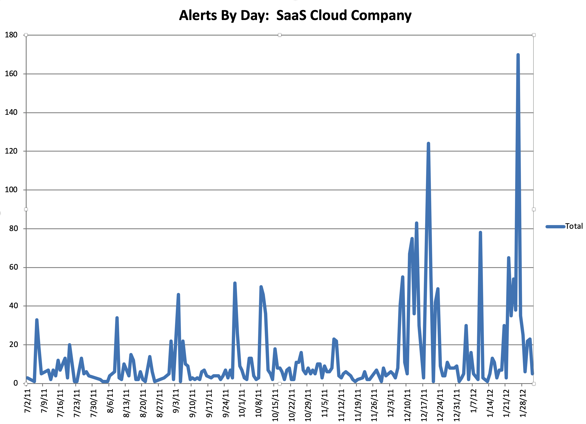
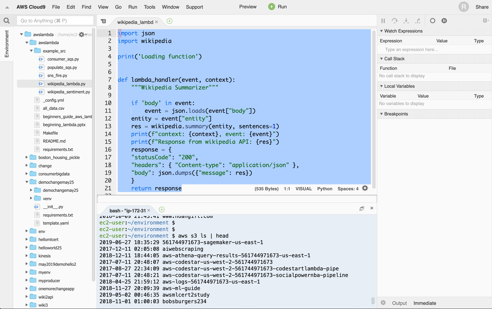
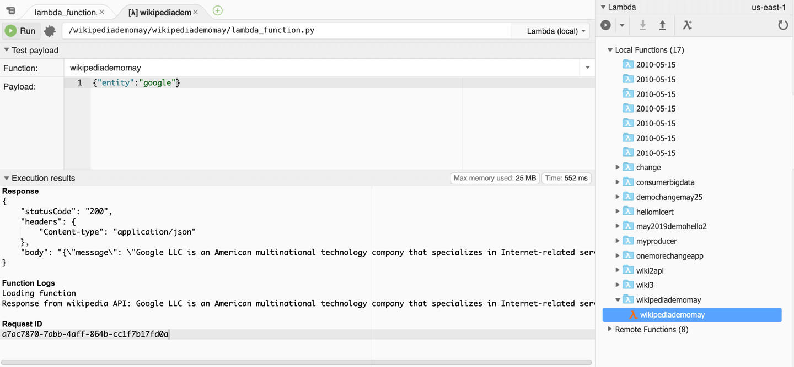
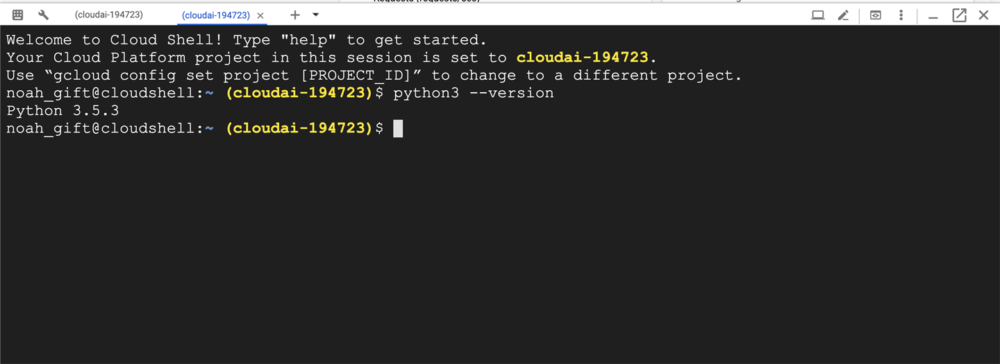
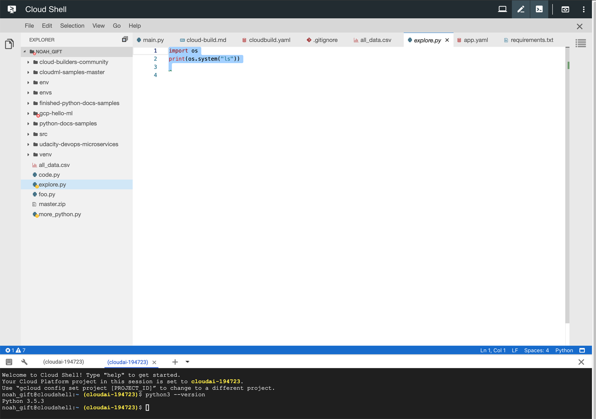
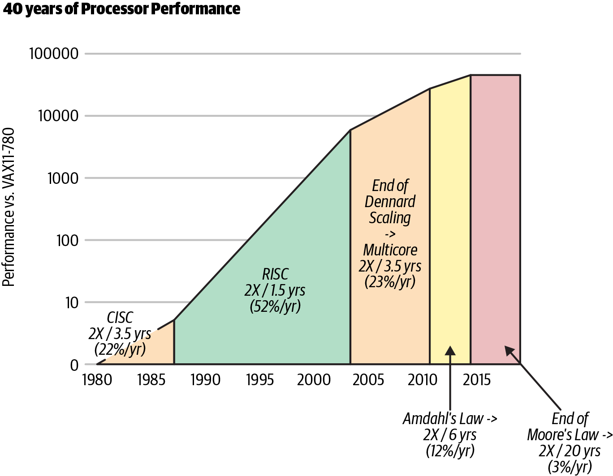
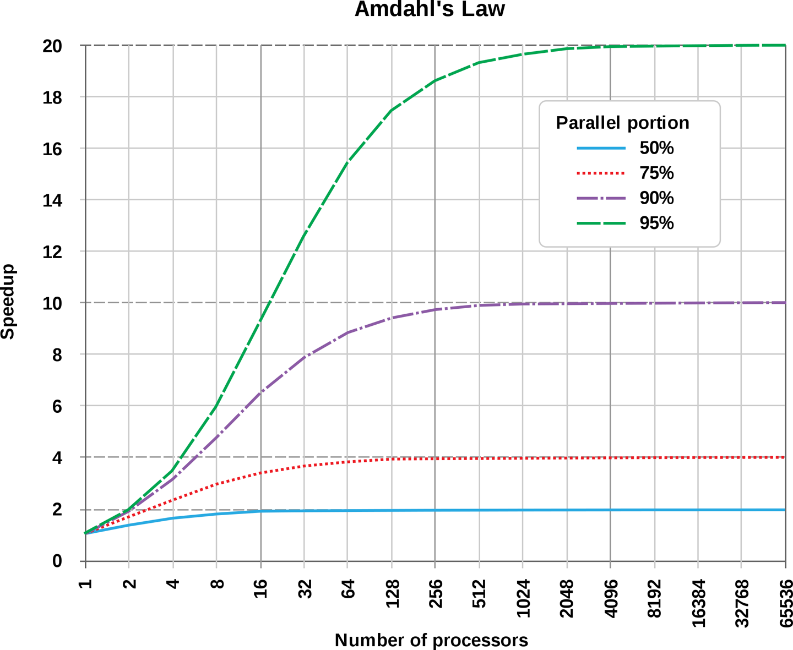
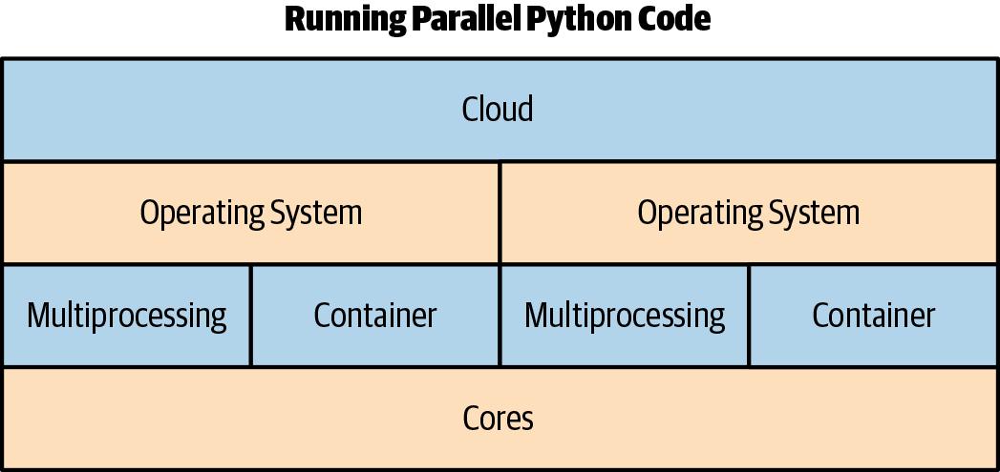

# Chapter 9. Cloud Computing  

Cloud computing is a term that creates the same confusion as other popular modern buzzwords, such as Big Data, AI, and Agile. When a term gets popular enough, it eventually means many things to many people. Here is a precise definition. The cloud is the delivery of on-demand computing services where you pay for what you use, just like any other utility: natural gas, electricity, or water.

The top benefits of cloud computing include cost, speed, global scale, productivity, performance, reliability, and security. Let’s break down each one of these.

* *Cost*  
There is no up-front cost and resources can be precisely metered to meet demand.

* *Speed*  
The cloud offers self-service, so an expert user can leverage the resources to build solutions quickly.

* *Global scale*  
All major cloud providers have a global scale, which means services can be provisioned all over the world to meet demand in a geographic region.

* *Productivity*  
Many tasks, such as racking servers, configuring network hardware, and physically securing a data center, no longer exist. Companies can focus on building core intellectual property versus reinventing the wheel.

* *Performance*  
Unlike hardware you own, cloud hardware is continually upgraded, meaning that the fastest and latest hardware is always available on demand. All of the hardware is also joined together on low-latency and high-bandwidth infrastructure, creating an ideal high-performance environment.

* *Reliability*  
The core architecture of the cloud offers redundancy at every step. There are multiple regions and multiple data centers in each region. Cloud native architecture can design around these capabilities, leading to highly available architectures. Additionally, many core cloud services are themselves highly available, like Amazon S3, which has nine nines, or 99.999999999% reliability.

* *Security*  
You are only as good as your weakest link with security. By consolidating to centralized security, a higher level of security occurs. Problems such as physical access to a data center or encryption at rest become industry standard on day one.

## Cloud Computing Foundations  
In some ways, it is hard to think about DevOps without also thinking about the cloud. Amazon describes the following as DevOps best practices: Continous Integration, Continous Delivery, Microservices, Infrastructure as Code, Monitoring and Logging, and Communication and Collaboration. Of these best practices, you could argue that all of them depend on the cloud’s existence. Even the harder to define practice of “Communication and Collaboration” is made possible by a modern suite of SaaS communication tools: Jira, Trello, Slack, GitHub, and others. Where do all of these SaaS communication tools run? In the cloud.

What is unique about the modern cloud era? There are at least three defining characteristics: theoretical infinite computing resources, on-demand access computing resources, and no up-front commitment of capital. Hidden inside these characteristics is DevOps skills Pareto distribution.

In practice, the cloud becomes incredibly cost effective when used in a manner that supports the real efficiencies of the cloud. On the other hand, for unsophisticated organizations using the cloud, it can be incredibly expensive because they are not taking advantage of the core features of the cloud. It is probably fair to say that 80% of the gross profits of the cloud in the early days were derived from unsophisticated users who left instances idle, chose the wrong instances (too big), didn’t architect for auto-scaling, or used software architectures that were noncloud native, such as shoving everything into a relational database. Likewise, the remaining 20% of gross profits were derived from incredibly thrifty organizations with exceptional DevOps skills.

Before the cloud existed, there was a fixed cost that never went away. This cost was fixed both in terms of money and in developer time. A data center had to be maintained by a team of people, and that was a full-time job and very expensive. As the cloud has grown in maturity, only the best of the best now work in data centers, and they are working for incredibly sophisticated organizations like Google, Microsoft, and Amazon. It isn’t statistically possible for a small company to have the hardware talent of a data center engineer at that level, at least over the long term.

A fundamental law of economics is the principle of comparative advantage. Instead of looking at what the cloud costs and thinking that you can save money by doing it yourself, look at the opportunity cost of not doing something else. Most organizations have concluded that:

1. They cannot compete at the level of Google, Amazon, and Microsoft in data center expertise.

2. Paying for cloud services allows the company to focus on other areas where they can use their unique skills.

Netflix has decided to focus on delivering streaming services and creating original content than running its own data centers. If you look at the Netflix 11-year stock price from 2008 to 2019 (Figure 9-1), it’s hard to argue with this strategy.

  
*Figure 9-1. Netflix 11-year stock price*  

What is unique about Netflix, though, is its dedication to operational excellence in the cloud. Current or former Netflix employees have given numerous talks at conferences, developed and released tools on GitHub, and written articles and books on DevOps and cloud computing topics. This further supports the point that it isn’t enough to realize that the cloud is the correct choice, but this decision must be backed up by operational excellence. Otherwise, an organization risks being the equivalent of the gym member who signs up for a year membership, yet only goes for three weeks. The members that don’t go to the gym subsidize the cost of the gym for the other members who attend regularly.

## Types of Cloud Computing  
There are several main types of cloud computing: public cloud, private cloud, hybrid cloud, and multicloud. The majority of the time when you hear about the cloud, it is about a public cloud. It is isn’t the only type of cloud, however. A private cloud is used exclusively by an organization, and is either physically located in that organization’s data center, or it can be hosted for an organization by another company. Some examples of private cloud providers are HPE, VMware, Dell, and Oracle. A popular open source private cloud option is OpenStack. An excellent example of how that could look in practice is that Rackspace, a more niche alternative in the hosting space, is one of the largest providers of OpenStack private clouds as a service.

A more flexible option is the hybrid cloud. The hybrid cloud combines both a private and public cloud. An example of this type of architecture involves using the public cloud for situations that require scalability and extra capacity, and using a private cloud for day-to-day operations. Another example could involve a specialized hardware architecture, say, a farm of GPUs that perform deep learning in a private cloud, and the connected public cloud serves at the core infrastructure. Even major cloud vendors are entering this space. A good example is the Anthos platform from Google. This platform does the hard work of linking an on-premises data center with GCP to allow workflows, such as running Kubernetes clusters in both locations in a seamless manner.

Finally, multicloud is a choice that is enabled partially by modern DevOps technologies such as Docker containers, and IaC solutions such as Terraform. A multicloud strategy is one that involves using multiple clouds at the same time. An excellent example of this is running jobs in containers on multiple clouds simultaneously. Why would you do this? For one reason, you could decide to run jobs on AWS Spot Instances when the price was suitable to make a profit, but on GCP when AWS was too expensive. Tools like Terraform allow you to abstract away cloud concepts into a familiar configuration language, while containers allow code and an execution environment to travel to any destination that can run a container.

## Types of Cloud Services  
There are five main types of cloud services: Infrastructure as a Service (IaaS), Metal as a Service (MaaS), Platform as a Service (PaaS), serverless, and Software as a Service (SaaS). Each of these cloud services works at a different layer of abstraction and has pros and cons. Let’s break down each service.

### Infrastructure as a Service  
IaaS is a lower-level category that includes the ability to rent virtual machines by the minute, access object storage, provision software-defined network (SDN) and software-defined storage (SDS), and bid for an available virtual machine. This level of service is most closely associated with AWS, especially in the early years (2006) when Amazon launched S3 cloud storage, SQS (Simple Queue Service), and EC2 (virtual machines).

The advantage of this service for an organization with strong expertise in DevOps is that it can be incredibly cost-effective and reliable with a small team of people. The disadvantage is that IaaS has a steep learning curve, and when administered inefficiently, it can be expensive in terms of cost and human labor. In the Bay Area during 2009–2019, this scenario played out in real-time on AWS at many companies.

One story that brings this home occurred when Noah ran engineering at a SaaS company that provided monitoring and search tools. During his first month on the job, there were two mission-critical problems involving the cloud. The first problem, which occurred during week one, was that the SaaS billing system misconfigured the storage system. The company was deleting data from paying customers! The gist of the problem was that they didn’t have the necessary DevOps infrastructure needed to succeed in the cloud: no build server, no testing, no real isolated development environments, no code review, and limited ability to deploy software automatically. The fix Noah implemented were these DevOps practices, while a figurative raging fire burned.

> **NOTE**  
> A developer did set fire to the office by cooking bacon in a toaster oven. Noah thought he smelled smoke, so he walked into the kitchen and flames were crawling up the walls and the ceiling. He was so stunned at the sheer irony of the situation that he sat there for a few seconds, soaking it in. Fortunately, a quick-thinking co-worker (his product manager) grabbed the fire extinguisher and put out the fire.

A second, more serious, problem with our cloud architecture occurred shortly afterward. All of the developers in the company had to be on call so that there would be 24/7 coverage (except the CTO/founder who often wrote code that was directly or indirectly responsible for outages. . .more on that later). One night when Noah was on call, he was awoken at 2 A.M. by a call from the CEO/founder on his cell phone. He told Noah they had been hacked and that the entire SaaS system did not exist anymore. There were no web servers, search endpoints, or any other virtual machine running the platform in existence. Noah asked why he hadn’t received a page, and the CEO said the monitoring system was also deleted. Noah decided to drive into work at 2 A.M. and work on the problem from there.

As more information surfaced, the issue became apparent. The CEO and founder had set up the AWS account initially, and all emails about service interruptions went to his email. For several months, Amazon had been sending him emails about how virtual machines in our region, Northern Virginia, needed to be retired, and that in the coming months they would be deleted. Well, that day eventually came, and in the middle of the night, that entire company’s servers ceased to exist.

Noah found this out as he drove into work, so he then focused on building an entire SaaS company again from scratch, using the source code in GitHub. It was at this point that Noah began to understand both the power and the complexity of AWS. It took him from 2 A.M. until about 8 P.M. to get the SaaS system operational and able to accept data, process payments, and serve out dashboards. It took another 48 hours to completely restore all of the data from backups.

One of the reasons it took so long to get things running again is that the deployment process was centralized around a forked version of Puppet that a previous employee created but never checked into version control. Fortunately, Noah was able to find a copy of that version of Puppet at around 6 A.M. on one lone machine that survived the carnage. If this machine hadn’t existed, it might have been the end of the company. It would have taken perhaps a week to completely rebuild a company of that complexity without some Infrastructure as Code (IAC) scaffolding.

An experience this stressful that had a reasonably happy ending taught him a lot. Noah realized this was the trade-off of the cloud; it was incredibly powerful, but the learning curve was crushing even for VC-funded startups in the Bay Area. Now back to the CTO/founder who wasn’t on call, but checked code into production (without using a build server or continuous integration system). This person wasn’t the villain of the story. It is possible that if Noah himself was the CTO/founder of a company at a certain point in his career, he might have made the same mistakes.

The real issue is the power dynamic. Hierarchy does not equal being correct. It is easy to get drunk on your power and believe that because you are in charge, what you do always makes sense. When Noah ran a company, he made similar mistakes. The key takeaway is that the process has to be right, not the individual. If it isn’t automated, it is broken. If it isn’t going through some type of automated quality control test, then it is also broken. If the deployment isn’t repeatable, it is also broken.

One final story to share about this company involves monitoring. After those two initial crises, the symptoms resolved, but the underlying diseases were still malignant. There was an ineffective engineering process in the company. Another story highlights the underlying problem. There was a homegrown monitoring system (again, initially created by the founders) that on average generated alerts every 3-4 hours, 24 hours a day.

Because everyone in engineering except the CTO was on call, most of the engineering staff was always sleep deprived because they received alerts about the system not working every night. The “fix” to the alerts was to restart services. Noah volunteered to be on call for one month straight to allow engineering the time to fix the problem. This sustained period of suffering and lack of sleep led him to realize several things. One, the monitoring system was no better than random. He could potentially replace the entire system with this Python script:
```py
from  random import choices

hours = list(range(1,25))
status = ["Alert", "No Alert"]
for hour in hours:
    print(f"Hour: {hour} -- {choices(status)}"
```
```
✗ python random_alert.py
Hour: 1 -- ['No Alert']
Hour: 2 -- ['No Alert']
Hour: 3 -- ['Alert']
Hour: 4 -- ['No Alert']
Hour: 5 -- ['Alert']
Hour: 6 -- ['Alert']
Hour: 7 -- ['Alert']
Hour: 8 -- ['No Alert']
Hour: 9 -- ['Alert']
Hour: 10 -- ['Alert']
Hour: 11 -- ['No Alert']
Hour: 12 -- ['Alert']
Hour: 13 -- ['No Alert']
Hour: 14 -- ['No Alert']
Hour: 15 -- ['No Alert']
Hour: 16 -- ['Alert']
Hour: 17 -- ['Alert']
Hour: 18 -- ['Alert']
Hour: 19 -- ['Alert']
Hour: 20 -- ['No Alert']
Hour: 21 -- ['Alert']
Hour: 22 -- ['Alert']
Hour: 23 -- ['No Alert']
Hour: 24 -- ['Alert']
```
Once he realized this, he dug into the data and created a historical picture of every single alert for the last year by day (note that these alerts were meant to be actionable and to “wake you up”). From Figure 9-2, you can see that not only did the alerts not make sense, but they were increasing to a frequency that was ridiculous in hindsight. They were “cargo culting” engineering best practices and figuratively waving palm tree branches at a dirt runway filled with airplanes built out of straw.

  
*Figure 9-2. SaaS company alerts daily*  

In looking at the data, it was even more distressing to learn that engineers had spent YEARS of their lives responding to pages and getting woken up at night, and it was utterly useless. The suffering and sacrifice accomplished nothing and reinforced the sad truth that life is not fair. The unfairness of the situation was quite depressing, and it took quite a bit of convincing to get people to agree to turn off the alerts. There is a built-in bias in human behavior to continue to do what you have always done. Additionally, because the suffering was so severe and sustained, there was a tendency to attribute a deeper meaning to it. Ultimately, it was a false god.

The retrospective on using AWS cloud IaaS for that particular company is, in fact, the selling points of DevOps:

1. You must have a delivery pipeline and feedback loop: build, test, release, monitor, and then plan.

2. Development and operations are not silos. If the CTO is writing code, they should also be on call (the pain and suffering from years of being woken up would serve as the correct feedback loop).

3. Status in a hierarchy is not more important than the process. There should be a collaboration between team members that emphasizes ownership and accountability, regardless of title, pay, or experience level.

4. Speed is a fundamental requirement of DevOps. As a result, microservices and continuous delivery are requirements because they let teams take ownership of their services and release software more quickly.

5. Rapid delivery is a fundamental requirement of DevOps, but it also requires continuous integration, continuous delivery, and effective and actionable monitoring and logging.

6. It provides the ability to manage infrastructure and development processes at scale. Automation and consistency are hard requirements. Using IaC to manage development, testing, and production environments in a repeatable and automated manner are the solution.

### Metal as a Service  
MaaS allows you to treat physical servers like virtual machines. The same ease of use in managing clusters of virtual machines works for physical hardware. MaaS is the name of a service offering by Canonical, which the owner of Canonical, Mark Shuttleworth, describes as “cloud semantics” to the bare metal world. MaaS could also refer to the concept of using physical hardware from a vendor that treats hardware much like virtualized hardware. An excellent example of a company like this is SoftLayer, a bare metal provider acquired by IBM.

In the pro category, having full control over hardware does have a certain appeal for niche applications. An excellent example of this could be using a GPU-based database. In practice, a regular public cloud could offer similar services, so a full cost-benefit analysis helps when justifying when to use MaaS.

### Platform as a Service  
PaaS is a complete development and deployment environment that has all of the resources necessary to create cloud services. Examples of this include Heroku and Google App Engine. PaaS differs from IaaS in that it has development tools, database management tools, and high-level services that offer “point and click” integration. Examples of the types of services that can be bundled are an authentication service, a database service, or a web application service.

A justifiable criticism of PaaS is that it can be much more expensive in the long term than IaaS, as discussed previously; however this depends on the environment. If the organization is unable to enact DevOps behaviors, then the cost is a moot point. In that case, it would be better to pay for a more expensive service that provides more of those capabilities. The opportunity cost of an organization that needs to learn the advanced capabilities of managing an IaaS deployment may be too high for the short life span of a startup. It may be smarter for an organization to offload those capabilities to a PaaS provider.

### Serverless Computing  
Serverless is one of the newer categories of cloud computing, and it is still actively in development. The real promise of serverless is the ability to spend more time building applications and services and less or no time thinking about how they run. Every major cloud platform has a serverless solution.

The building block for serverless solutions is a compute node or Function as a Service (FaaS). AWS has Lambda, GCP has Cloud Functions, and Microsoft has Azure Functions. Traditionally, the underlying execution of these cloud functions has been abstracted away for a runtime, i.e., Python 2.7, Python 3.6, or Python 3.7. All of these vendors support Python runtimes, and in some cases, they also support customizing the underlying runtime via a customized Docker container. Here is an example of a straightforward AWS Lambda function that grabs the first page of Wikipedia.

There are a few things to point out about this Lambda function. The logic itself is in the lambda_handler and it takes two arguments. The first argument, event, is from whatever has triggered it. The Lambda could be anything from an Amazon Cloud Watch event timer to running it with a payload crafted from the AWS Lambda Console. The second argument, context, has methods and properties that provide information about the invocation, function, and execution environment.
```py
import json
import wikipedia

print('Loading function')

def lambda_handler(event, context):
    """Wikipedia Summarizer"""

    entity = event["entity"]
    res = wikipedia.summary(entity, sentences=1)
    print(f"Response from wikipedia API: {res}")
    response = {
    "statusCode": "200",
    "headers": { "Content-type": "application/json" },
    "body": json.dumps({"message": res})
    }
    return response
```
To use the Lambda function a JSON payload is sent in:
```json
{"entity":"google"}
```
The output of the Lambda is also a JSON payload:
```json
Response
{
    "statusCode": "200",
    "headers": {
        "Content-type": "application/json"
    },
    "body": "{\"message\": \"Google LLC is an American multinational technology"}
}
```
One of the most potent aspects of FaaS is the ability to write code that responds to events versus code that is continuously running: i.e., a Ruby on Rails application. FaaS is a cloud-native capability that truly exploits what a cloud is best at—elasticity. Additionally, the development environment for writing lambda functions has evolved considerably.

Cloud9 on AWS is a browser-based development environment with deep integrations into AWS (Figure 9-3).

  
*Figure 9-3. Using AWS Cloud9*  

Cloud9 is now my preferred environment for writing AWS Lambda functions and for running code that needs the AWS API keys. Cloud9 has built-in tools for writing AWS Lambda functions that make it straightforward to build and test them locally, as well as deploy them into AWS.

Figure 9-4 shows how you can pass in JSON payload and test a lambda locally in Cloud9. Testing this way is a significant advantage of the evolving platform.

  
*Figure 9-4. Running Lambda Function in Cloud9*  

Likewise, Google Cloud starts you off with the GCP Cloud Shell environment (see Figure 9-5). Cloud Shell also allows you to bootstrap development quickly, with access to critical command-line tools and a full development environment.

  
*Figure 9-5. GCP Cloud Shell*  

The GCP Cloud Shell editor (see Figure 9-6) is a full-fledged IDE with syntax highlighting, a file explorer, and many other tools generally found in a traditional IDE.

  
*Figure 9-6. GCP Cloud Shell editor*  

The key takeaway is that with the cloud, it is also best to use native development tools when possible. It reduces security holes, limits slowdowns from transferring data from your laptop to the cloud, and increases productivity due to the deep integration with its native environment.

### Software as a Service  
SaaS and the cloud have been joined together from day one. As the cloud gets features, SaaS products continue to distribute innovation on top of the innovations of the cloud. There are many advantages of SaaS products, especially in the DevOps space. For example, why build a monitoring solution yourself if you can rent it, especially when first starting. Additionally, many core DevOps principles, such as continuous integration and continuous delivery, are also made available by SaaS applications offered by cloud vendors, such as AWS CodePipeline, or third-party SaaS solutions like CircleCI.

In many cases, the ability to mix IaaS, PaaS, and SaaS allows modern companies to develop products in a much more reliable and efficient manner than they could 10 years prior. Every year it gets easier to build software, thanks to the rapid evolution not just of the cloud, but of the SaaS companies building solutions on top of the cloud.

## Infrastructure as Code  
IaC is covered in much greater detail in Chapter 10; refer to that chapter for a more detailed breakdown of IaC. Regarding the cloud and DevOps, though, IaC is a fundamental aspect of real-world cloud computing. IaC is a must-have capability to implement DevOps practices on the cloud.

## Continuous Delivery  
Continuous delivery is a newer term that can be easily confused between continuous integration and continuous deployment. The critical difference is that software is delivered to some environment, say a staging environment, where it can undergo both automated and manual testing. Although it doesn’t require deployment immediately, it is in a deployable state. More detailed explanations of build systems can be found in Chapter 15, but it is also worth pointing out that this is a fundamental requirement to using the cloud correctly.

## Virtualization and Containers  
There is no more fundamental component of the cloud then virtualization. When AWS officially launched in 2006, Amazon Elastic Compute Cloud (EC2) was one of the core services released. There are a few key areas of virtualization to discuss.

### Hardware Virtualization  
The first virtualization abstraction released by AWS was hardware virtualization. Hardware virtualization comes in two flavors: paravirtual (PV) or hardware virtual machine (HVM). The best performance comes from HVM. The critical difference in performance is that HVM can take advantage of hardware extensions that tap into the host’s hardware, essentially making the virtual machine a first-class member of the host’s hardware, rather than merely a guest that is unaware of what the host is doing.

Hardware virtualization provides the ability to run multiple operating systems on one host and the ability to partition CPU, I/O (both network and disk), and memory to the guest operating system. There are many advantages to this approach, and it is the foundation of the modern cloud, but there are also some unique challenges to Python itself. One issue is that often the layer of granularity is too large for Python to fully exploit the environment. Because of the limitations of Python and threads (they don’t work on multiple cores), a virtual machine that has two cores could be wasting one core. With hardware virtualization and the Python language, there can be a tremendous waste of resources due to a lack of true multithreading. A virtual machine configuration for a Python application can often leave one or more cores idle, wasting both money and energy. Fortunately, the cloud has presented new solutions that help eliminate these defects in the Python language. In particular, containers and serverless eliminate this problem because they treat the cloud as an operating system, and instead of threads, there are lambdas or containers. Instead of threads that listen on queues, lambdas respond to events from a cloud queue, such as SQS.

### Software Defined Networks  
Software Defined Networks (SDNs) are an essential component of cloud computing. The killer feature of SDNs is the ability to dynamically and programmatically change network behavior. Before this capability, this often rested in the hands of a networking guru who managed this F5 load balancer with an iron fist. Noah once worked at a large telecommunications company where there was a daily meeting called “Change Management” with a single individual—let’s call him Bob—who controlled every piece of software that was released.

It takes a unique personality to be a Bob. There were often yelling matches between Bob and people in the company. It was the classic IT Operations versus Development battle, and Bob delighted in saying no. The cloud and DevOps completely eliminate this role, the hardware, and the weekly shouting matches. Continuous delivery processes are building and deploying software consistently with the exact configuration, software, and data needed for a production environment. Bob’s role melted into ones and zeros deep inside the Matrix, replaced by some Terraform code.

### Software Defined Storage  
Software Defined Storage (SDS) is an abstraction that allows storage to provision on demand. This storage can be configured with granular Disk I/O and Network I/O. A good example is Amazon EBS volumes where you can configure provisioned Disk I/O. Typically, cloud SDS grows Disk I/O automatically with the volume size. An excellent example of how that works in practice is Amazon Elastic File System (EFS). EFS increases Disk I/O as the storage size grows (this occurs automatically) and is designed to support requests from thousands of EC2 instances concurrently. It also has deep integration with Amazon EC2 instances that allow pending writes to buffer and occur asynchronously.

Noah has good experience using EFS in precisely this situation. Before AWS Batch was available, he architected and wrote a system that employed thousands of spot instances that mounted EFS volumes, where they performed distributed computer vision jobs they collected from Amazon SQS. The ability to use a distributed filesystem that is always on is a massive advantage for distributed computing, and it simplifies everything from deployment to cluster computing.

### Containers  
Containers have been around for decades, and they refer to OS-level virtualization. The kernel allows the existence of isolated user-space instances. In the early 2000s, there was an explosion of hosting companies that used virtual hosting of Apache websites as a form of OS-level virtualization. Mainframes and classic Unix operating systems such as AIX, HP-UX, and Solaris have also had sophisticated forms of containers for years. As a developer, Noah worked with Solaris LDOM technology when it came out in 2007 and was in awe at how he could install full operating systems that allowed granular control of CPU, memory, and I/O all from telneting into a machine with a lights-out management card.

The modern version of containers is under rapid development, borrows the best things from the mainframe era, and combines them with newer ideas like source control. In particular, one of the significant revolutions with containers is to treat them as projects that check out of version control. Docker containers are now the standard format for containers, and all major cloud vendors support Dockerfile containers, along with Kubernetes container management software. There is more information on containers in Chapter 12, but the essential items that relate to the cloud are listed here:

* *Container registry*  
All cloud providers have a container registry where they keep your containers.

* *Kubernetes management service*  
All cloud providers have a Kubernetes offering, and this is now the standard for managing container-based deployments.

* *Dockerfile format*  
This is the standard for building containers, and it is a simple file format. It is a best practice to use lint tools like hadolint in your build process to ensure simple bugs don’t leak through.

* *Continuous integration with containers*  
All cloud providers have cloud-based build systems that allow integration with containers. Google has Cloud Build, Amazon has AWS CodePipeline, and Azure has Azure Pipelines. They all can build containers and register them into a container registry, as well as build projects using containers.

* *Deep container integration into all cloud services*  
When you get into managed services in platforms on clouds, you can rest assured they all have one thing in common—containers! Amazon SageMaker, a managed machine learning platform, uses containers. The cloud development environment Google Cloud Shell uses containers to allow you to customize your development environment.

## Challenges and Opportunities in Distributed Computing  
One of the most challenging areas of computer science is distributed computing. In the modern era of cloud computing, there a few fundamental shifts that have changed everything. One of the most significant shifts is the rise of multicore machines and the end of Moore’s Law. See Figure 9-7.

  
*Figure 9-7. End of Moore’s Law (Source: John Hennessy and David Patterson, Computer Architecture: A Quantitative Approach, 6/e. 2018)*  
Moore’s Law exposed two fundamental problems that manifest themselves in the cloud era. The first problem is that CPUs are designed to be multipurpose processors. They are not specialized to run parallel workloads. If you couple that with the ultimate physical limits of increasing CPU speed, the CPU has become less critical in the cloud era. In 2015, Moore’s Law was effectively over, and gains are at 3% a year.

The second problem is that making multiple core machines to counteract the limitations of single processor speed has led to a ripple effect on software languages. Many languages previously had substantial problems taking advantage of multiple cores because they were designed in an era before multiple processors existed, let alone the internet. Python is a good case in point here. What makes things even more challenging, Figure 9-8 shows that there is “no free lunch” by adding more cores to a problem that is not mostly parallel.

  
*Figure 9-8. Amdahl’s Law*  

The opportunity is in the cloud and different architectures like application-specific integrated circuits (ASICs). These include graphic processing units (GPUs), field-programmable gate arrays (FPGAs), and tensor processing units (TPUs). These specialized chips are increasingly being used in machine learning workloads and are paving the way for cloud architectures that use a combination of different hardware to tackle complex problems in distributed computing.

## Python Concurrency, Performance, and Process Management in the Cloud Era  
Imagine walking down a dark street in San Francisco late at night in a dangerous part of the city. In this scenario, you are a black belt in Brazilian Jiu-Jitsu. You are alone and notice that a stranger seems to be following you. Your heart starts to race as they approach and you think about your years of martial arts training. Will you have to fight a stranger in the street? You actively spar with opponents at your gym several times per week. You feel prepared to defend yourself if you need to. You also know that Brazilian Jiu-Jitsu is an efficient martial art, and it works in real-world situations.

On the other hand, fighting someone is still something to avoid. It is dangerous. Weapons could be involved. You could win the fight, yet seriously injure your opponent. You could lose the fight and become seriously injured yourself. Even an expert in Brazilian Jiu-Jitsu knows that a street fight is not a preferred scenario, despite the high probability of winning.

Concurrency in Python is very similar. There are some handy patterns like multiprocessing and asyncio. It is better to use concurrency sparingly. Often the other option is to use the platform’s concurrency options (serverless, batch processing, spot instances) versus the concurrency you create yourself via a programming language.

## Process Management  
Process management in Python is a standout capability of the language. When Python acts as a glue to other platforms, languages, and processes, this is when it is at its best. Also, the actual implementation of process management has dramatically changed over the years and continues to improve.

### Manage Processes with Subprocess  
The simplest and most effective way to launch processes with the standard library is to use the run() function. As long as you have python 3.7 or higher installed, start here and simplify your code. A hello world example is just a line of code:
```py
out = subprocess.run(["ls", "-l"], capture_output=True)
```
This line does almost everything you might want. It invokes a shell command in a Python subprocess and captures the output. The return value is an object of type CompletedProcess. This has the args used to launch the process: the returncode, stdout, stderr, and check_returncode.

This one-liner replaces and streamlines overly verbose and complicated methods of invoking shell commands. This is great for a developer who frequently writes Python code mixed with shell commands. Here are a few more tips that might be helpful to follow.

### AVOID SHELL=TRUE  
It is a security best practice to invoke a command as items in a list:
```py
subprocess.run["ls", "-la"]
```
It is best to avoid using a string:
```py
#AVOID THIS
subprocess.run("ls -la", shell=True)
```
The reason for this is straightforward. It is easy to introduce a security hole accidentally if you accept any string and execute it. Let’s suppose you wrote a simple program that allowed a user to list a directory. A user can backdoor any command they want and hitchhike on your program. Writing an accidental backdoor is very scary and hopefully illustrates what a bad idea it is to use shell=True!
```py
#This is input by a malicious user and causes permanent data loss
user_input = 'some_dir && rm -rf /some/important/directory'
my_command = "ls -l " + user_input
subprocess.run(my_command, shell=True)
```
Instead, you can completely prevent that by not allowing strings:
```py
#This is input by a malicious user and does nothing
user_input = 'some_dir && rm -rf /some/important/directory'
subprocess.run(["ls", "-l", user_input])
```
### SET TIMEOUTS AND HANDLE THEM WHEN APPROPRIATE  
If you are writing code that invokes a process that may take some time to run, you should create a sensible default timeout. An easy way to experiment with how this works is to use the Unix sleep command. Here is an example of a sleep command that finishes before the timeout triggers in the IPython shell. It returns a CompletedProcess object:
```py
In [1]: subprocess.run(["sleep", "3"], timeout=4)
Out[1]: CompletedProcess(args=['sleep', '3'], returncode=0)
```
Here is a second version that throws an exception. In most cases, it would be wise to do something useful with this exception:
```
----> 1 subprocess.run(["sleep", "3"], timeout=1)

/Library/Frameworks/Python.framework/Versions/3.7/lib/python3.7/subprocess.py
 in run(input, capture_output, timeout, check, *popenargs, **kwargs)
    477             stdout, stderr = process.communicate()
    478             raise TimeoutExpired(process.args, timeout, output=stdout,
--> 479                                  stderr=stderr)
    480       except:  # Including KeyboardInterrupt, communicate handled that.
    481             process.kill()

TimeoutExpired: Command '['sleep', '3']' timed out after 1 seconds
```
A reasonable approach is to catch this exception TimeoutExpired and then to log the exception and implement some cleanup code:
```py
import logging
import subprocess

try:
    subprocess.run(["sleep", "3"], timeout=4)
except subprocess.TimeoutExpired:
    logging.exception("Sleep command timed out")
```
Logging exceptions are critically important when building systems at the professional level. If this code is later deployed on many machines, it could become impossible to track down an error without a centralized logging system that is searchable. For DevOps professionals, it is critically essential to follow this pattern and evangelize its usefulness.

### THE PROBLEM WITH PYTHON THREADS  
You may have had a friend your parents told you not to hang out with when you were growing up. If so, it was most likely because your parents were trying to help you avoid bad choices. Python threads are a lot like that lousy friend you had growing up. Things are not going to end well if you keep associating yourself with them.

Threads in other languages are a reasonable trade-off. In a language like C#, you can execute thread pools that connect to queues and expect that each thread that spawned can take advantage of all of the cores on the device. This well-proven pattern of using threads with queues decreases the downsides of manually setting and removing locks in code.

Python doesn’t work this way. If you spawn threads, it won’t use all of the cores on your machine, and it can often behave in a nondeterministic fashion, bouncing from core to core and even “slowing down your code.” Why use something like this when there are alternatives?

If you are interested in learning more about DevOps, then chances are you’re focused on pragmatism. You only want to learn and apply the knowledge that is practical and makes sense. Pragmatism is yet another reason to avoid threads in Python. In theory, you could use threads in some situations and get a performance increase if the problem was I/O bound. However, again, why use an unreliable tool when reliable tools exist? Using Python threads is like driving a car that requires you to push it and jump-start it by popping the clutch because the battery is flaky. What happens the day you don’t have room to jump-start it, or can’t park the car on a hill? Using this strategy is pure madness!

There are no examples of using threads in this chapter. Why show something that is incorrect? Instead of using threads, focus on other alternatives outlined in this chapter.

### Using Multiprocessing to Solve Problems
The multiprocessing library is the only unified way to use all of the cores on a machine using the standard library in Python. In looking at Figure 9-9, there are a couple of options at the operating system level: multiprocessing and containers.

  
*Figure 9-9. Running parallel Python code*  

Using containers as an alternative is a crucial distinction. If the purpose of using the multiprocessing library is to invoke a process many times without interprocess communication, a strong argument could be made to use a container, virtual machine, or cloud-native construct such as Function as a Service. A popular and effective cloud-native option is AWS Lambda.

Likewise, a container has many advantages over forking processes yourself. There are many advantages to containers. Container definitions are code. Containers can be sized precisely at the level needed: i.e., memory, CPU, or disk I/O. They are a direct competitor and often a better replacement for forking processes yourself. In practice, they can also be much easier to fit into a DevOps mindset.

From a DevOps perspective, if you buy into the idea that you should avoid concurrency in Python that you implement yourself unless it is the only option, then even the scenario when you use the multiprocessing module is limited. It may be that multiprocessing is best used as a tool in development and experimentation only, since much better options exist at both the container and cloud level.

Another way to put this is to ask who you trust to fork processes: the multiprocessing code you wrote in Python, the developers from Google who wrote Kubernetes, or the developers at Amazon who wrote AWS Lambda? Experience tells me that I make the best decisions when I stand on the shoulders of giants. With that philosophical consideration out of the way, here are some ways to use multiprocessing effectively.

### Forking Processes with Pool()  
A straightforward way to test out the ability to fork multiple processes and run a function against them is to calculate KMeans clustering with the sklearn machine learning library. A KMeans calculation is computed intensively and has a time complexity of O(n**2), which means it grows exponentially slower with more data. This example is a perfect type of operation to parallelize, either at the macro or the micro level. In the following example, the make_blobs method creates a dataset with 100k records and 10 features. This process has timing for each KMeans algorithm as well as the total time it takes:
```py
from sklearn.datasets.samples_generator import make_blobs
from sklearn.cluster import KMeans
import time

def do_kmeans():
    """KMeans clustering on generated data"""

    X,_ = make_blobs(n_samples=100000, centers=3, n_features=10,
                random_state=0)
    kmeans = KMeans(n_clusters=3)
    t0 = time.time()
    kmeans.fit(X)
    print(f"KMeans cluster fit in {time.time()-t0}")

def main():
    """Run Everything"""

    count = 10
    t0 = time.time()
    for _ in range(count):
        do_kmeans()
    print(f"Performed {count} KMeans in total time: {time.time()-t0}")


if __name__ == "__main__":
    main()
```
The runtime of the KMeans algorithm shows that it is an expensive operation and to run 10 iterations takes 3.5 seconds:
```
(.python-devops) ➜  python kmeans_sequential.py
KMeans cluster fit in 0.29854321479797363
KMeans cluster fit in 0.2869119644165039
KMeans cluster fit in 0.2811620235443115
KMeans cluster fit in 0.28687286376953125
KMeans cluster fit in 0.2845759391784668
KMeans cluster fit in 0.2866239547729492
KMeans cluster fit in 0.2843656539916992
KMeans cluster fit in 0.2885470390319824
KMeans cluster fit in 0.2878849506378174
KMeans cluster fit in 0.28443288803100586
Performed 10 KMeans in total time: 3.510640859603882
```
In the following example, the multiprocessing.Pool.map, the method is used to distribute 10 KMeans cluster operations to a pool of 10 processes. This example occurs by mapping the argument of 100000 to the function do_kmeans:
```py
from multiprocessing import Pool
from sklearn.datasets.samples_generator import make_blobs
from sklearn.cluster import KMeans
import time

def do_kmeans(n_samples):
    """KMeans clustering on generated data"""

    X,_ = make_blobs(n_samples, centers=3, n_features=10,
                random_state=0)
    kmeans = KMeans(n_clusters=3)
    t0 = time.time()
    kmeans.fit(X)
    print(f"KMeans cluster fit in {time.time()-t0}")

def main():
    """Run Everything"""

    count = 10
    t0 = time.time()
    with Pool(count) as p:
        p.map(do_kmeans, [100000,100000,100000,100000,100000,
                    100000,100000,100000,100000,100000])

    print(f"Performed {count} KMeans in total time: {time.time()-t0}")


if __name__ == "__main__":
    main()
```
The run time of each KMeans operation is slower, but the overall speedup is double. This is a common issue with concurrency frameworks; there is overhead to distribute parallel work. There isn’t a “free lunch” to run the parallel code. The cost is that each task has a ramp-up time of about one second:
```
(.python-devops) ➜ python kmeans_multiprocessing.py
KMeans cluster fit in 1.3836050033569336
KMeans cluster fit in 1.3868029117584229
KMeans cluster fit in 1.3955950736999512
KMeans cluster fit in 1.3925609588623047
KMeans cluster fit in 1.3877739906311035
KMeans cluster fit in 1.4068050384521484
KMeans cluster fit in 1.41087007522583
KMeans cluster fit in 1.3935530185699463
KMeans cluster fit in 1.4161033630371094
KMeans cluster fit in 1.4132652282714844
Performed 10 KMeans in total time: 1.6691410541534424
```
This example shows why it is essential to profile code and also be careful about immediately jumping to concurrency. If the problem is small scale, then the overhead of the parallelization approach could slow the code down in addition to making it more complex to debug.

From a DevOps perspective, the most straightforward and most maintainable approach should always be the top priority. In practice, this could mean that this style of multiprocessing parallelization is a reasonable approach, but not before a macro-ready level parallelization approach has first been tried. Some alternative Macro approaches could be using containers, using FaaS (AWS Lambda or some other serverless technology), or using a high-performance server that Python runs workers against (RabbitMQ or Redis).

### Function as a Service and Serverless  
The modern AI era has created pressures that have enabled new paradigms. CPU clock speed increases have ground to a halt, and this has effectively ended Moore’s Law. At the same time, the explosion of data, the rise of cloud computing, and the availability of application specific integrated circuits (ASICs) have picked up that slack. Now a function as a unit of work has become an essential concept.

Serverless and FaaS can be used somewhat interchangeably, and they describe the ability to run a function as a unit of work on a cloud platform.

### High Performance Python with Numba  
Numba is a very cool library to experiment with for distributed problem-solving. Using it is a lot like modifying your car with high-performance aftermarket parts. It also leverages the trend of using ASICs to solve specific problems.

### Using Numba Just in Time Compiler  
Let’s take a look at the officially documented example of Numba Just in Time Compiler (JIT), tweak it a bit, and then break down what is happening.

This example is a Python function that is decorated by the JIT. The argument nopython=True enforces that the code passes through the JIT and is optimized using the LLVM compiler. If this option isn’t selected, it means that if something doesn’t translate to LLVM, it stays as regular Python code:
```py
import numpy as np
from numba import jit

@jit(nopython=True)
def go_fast(a):
    """Expects Numpy Array"""

    count = 0
    for i in range(a.shape[0]):
        count += np.tanh(a[i, i])
    return count + trace
```
Next, a numpy array is created, and the IPython magic function is used to time it:
```py
x = np.arange(100).reshape(10, 10)
%timeit go_fast(x)
```
The output shows that it took 855 nanoseconds to run the code:
```
The slowest run took 33.43 times longer than the fastest. This example could mean
that an intermediate result is cached. 1000000 loops, best of 3: 855 ns per loop
```
The regular version can be run using this trick to avoid the decorator:
```py
%timeit go_fast.py_func(x)
```
The output shows that without the JIT, regular Python code is 20 times slower:
```
The slowest run took 4.15 times longer than the fastest. This result could mean
that an intermediate run is cached. 10000 loops, best of 3: 20.5 µs per loop
```
With the Numba JIT, for loops are an optimization that it can speed up. It also optimizes numpy functions and numpy data structure. The main takeaway here is that it might be worth looking at existing code that has been running for years and seeing if critical parts of a Python infrastructure could benefit from being compiled with the Numba JIT.

### Using High-Performance Servers  
Self-actualization is an essential concept in human development. The simplest definition of self-actualization is an individual reaching their real potential. To do this, they must also accept their human nature with all of its flaws. One theory is that less than 1% of people have fully self-actualized.

The same concept can be applied to Python, the language. Fully accepting the strengths and weaknesses of the language allows a developer to utilize it fully. Python is not a high-performance language. Python is not a language optimized for writing servers like other languages are: Go, Java, C, C++, C#, or Erlang. Instead, Python is a language for applying high-level logic on top of high-performance code written in a high-performance language or platform.

Python is widely popular because it fits into the natural thought process of the human mind. With sufficient experience using the language, you can think in Python, just like you can think in your native language. Logic can be expressed in many ways: language, symbolic notation, code, pictures, sound, and art. Computer science constructs such as memory management, type declaration, concurrency primitives, and object-oriented design can be abstracted away from pure logic. They are optional to the expression of an idea.

The power of a language like Python is that it allows the user to work at the logic level, not the computer science level. What is the takeaway? Use the right tool for the job, and often this is the cloud or service in another language.

## Conclusion  
Both DevOps and data science share a common thread in that they are both job titles and capabilities. Some of the benefits of DevOps methodologies are speed, automation, reliability, scale, and security accomplished through pragmatism. Using macro-level solutions for concurrency and management of processes increases operation efficiency. Using micro-level solutions before looking at available frameworks and solutions is a dangerous DevOps antipattern.

* What are the takeaways for Python in the cloud era?  
* Learn to master the right concurrency technique for the task at hand.  
* Learn to use the high-performance computing library Numba to turbocharge your code with real threads, JIT, and the GPU.  
* Learn to use FaaS to solve unique problems elegantly.  
* Treat the cloud as an operating system and make it do the hard work of concurrency.  
* Embrace cloud-native constructs such as continuous delivery, Docker format containers, and serverless.  

## Exercises  
* What is IaaS?  
* What is PaaS?  
* What does elasticity mean?  
* What does availability mean?  
* What is block storage?  
* What are the different types of cloud computing services?  
* What is serverless?  
* What are some key differences between IaaS and PaaS?  
* What is the CAP Theorem?  
* What is Amdahl’s Law?  

## Case Study Questions  
* A company is hesitant to move into cloud computing because it has heard it can be more expensive. What are some ways to mitigate the cost risks of adopting cloud computing?  
* What is an example of a cloud-native architecture? Draw an architectural diagram of a cloud-native system and list the key features.  
* What do spot or preemptible instances do? How can they save money? What problems are they suitable for? What problems are they not suitable for?  